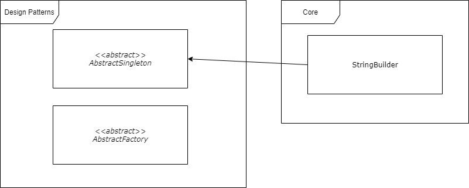



### [](#core-structure){:.book_mark}Core Structure ###

&nbsp;&nbsp;&nbsp;&nbsp;The **CryptoMañana (CryptoManana) cryptography framework** core has three main code portions
defined at the [`\CryptoManana\Core`](../api/namespaces/CryptoManana.Core.html "core"){:target="_blank"}:

- [`\CryptoManana\Core\Abstractions`](../api/namespaces/CryptoManana.Core.Abstractions.html){:target="_blank"} -
  Component abstractions;
- [`\CryptoManana\Core\Interfaces`](../api/namespaces/CryptoManana.Core.Interfaces.html){:target="_blank"} - Interface
  specifications;
- [`\CryptoManana\Core\Traits`](../api/namespaces/CryptoManana.Core.Traits.html){:target="_blank"} - Reusable traits.

&nbsp;&nbsp;&nbsp;&nbsp;The `Abstractions` and `Interfaces` namespaces follow the self-explanatory definition
arrangement:

- `Containers`;
- `DataStructures`;
- `DesignPatterns`;
- `ErrorHandling`;
- `MessageDigestion`;
- `MessageEncryption`;
- `Randomness`.

&nbsp;&nbsp;&nbsp;&nbsp;The `Traits` namespace follow a bit different, but still self-explanatory definition:

- `CommonValidations`;
- `Containers`;
- `DataStructures`;
- `MessageDigestion`;
- `MessageEncryption`;
- `Randomness`.

&nbsp;&nbsp;&nbsp;&nbsp;You will probably need to address the core structure when defining new future components and
reusing available validations or methods. In most cases, the PHPDoc collection stubs will guide your IDE or you can
check the [technical API documentation](../api/){:target="_blank"} for more details.

&nbsp;&nbsp;&nbsp;&nbsp;In addition, you can see the whole CryptoMañana (CryptoManana) cryptography
framework [ecosystem visualization at the technical API documentation](../api/graphs/class.html){:target="_blank"}.

### [](#string-builder){:.book_mark}String Builder ###

&nbsp;&nbsp;&nbsp;&nbsp;At the core namespace, there is only one defined singleton object that is used to support string
operations. It allows safe string manipulations and can utilize the `mbstring` extension if it is enabled (this was
previously discussed in the [installation guide](../docs/installation#support-various-encodings){:target="_blank"}).
Note that, you will only need this `\CryptoManana\Core\StringBuilder` component if you define new future algorithms
under the framework. The component supports the following self-explanatory methods:

```php
getInstance()
useMbString()
isUsingMbString()
stringLength()
stringToUpper()
stringToLower()
getChr()
getOrd()
stringReverse()
stringSplit()
stringReplace()
stringFullTrimming()
```

&nbsp;&nbsp;&nbsp;&nbsp;Here is a simple example of the components use:



```php
use CryptoManana\Core\StringBuilder;

$builder = StringBuilder::getInstance();

echo 'MbString: ' . $builder::isUsingMbString() . '<br>';
echo 'Example: ' . $builder::stringReverse('reversedя') . '<br>';

// Your system may not have it, of course
if (extension_loaded('mbstring')) {
    $builder::useMbString(true);

    echo 'Example: ' . $builder::stringReverse('reversedя') . '<br>';
}
```

&nbsp;&nbsp;&nbsp;&nbsp;The string builder definition is visualized as a technical diagram and can be seen in Figure 1.

{: .centered_item}

*Figure 1: The string builder core component.*{: .centered_item}

### [](#compatability-module){:.book_mark}Compatability Module ###

&nbsp;&nbsp;&nbsp;&nbsp;The last important namespace to be discussed is the
[`\CryptoManana\Compatibility`](../api/namespaces/CryptoManana.Compatibility.html "compatability"){:target="_blank"}
that contains pure PHP native implementations of standards that were not existing for previous versions or are removed
in the new ones. You should never use them directly, because they are used internally for some cryptographic
implementations for older versions. If there is a need for such cryptographic calculation, this is the namespace where
things will happen. In addition, the most realizations here are static and singleton, because of memory optimizations.
The compatibility namespace contains native implementations of the following algorithms:

- `NativeSha3`    Class NativeSha3 - Pure PHP implementation of the SHA-3 algorithm;
- `NativeHmacSha3` - Pure PHP implementation of the HMAC-SHA-3 algorithm;
- `NativeHkdfSha3`- Pure PHP implementation of the HKDF-SHA-3 algorithm;
- `NativePbkdf2Sha3` - Pure PHP implementation of the PBKDF2-SHA-3 algorithm;
- `NativeRc4` - Pure PHP implementation of the RC4-128 algorithm.

&nbsp;&nbsp;&nbsp;&nbsp;Once again, I repeat, **never use them directly** (unless you are not defining a new component)!

