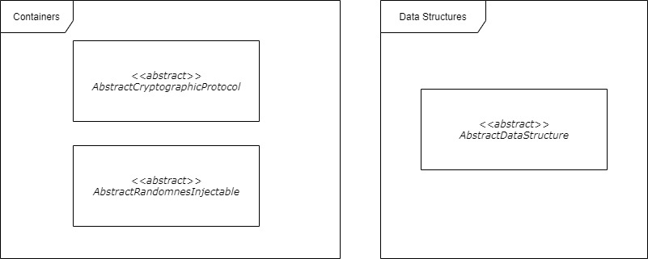



### [](#cryptographic-services){:.book_mark}Cryptographic Services ###

&nbsp;&nbsp;&nbsp;&nbsp;In the cryptography context, there are two main categories:

- Primitives - All types of primitive cryptographic types (one-way, symmetric, asymmetric systems, etc.);
- Services/Protocols - Defined methods, techniques and protocols that act as a secure service to achieve certain
  security task, that have primitive dependencies (authentication, key exchange or other complex system).

&nbsp;&nbsp;&nbsp;&nbsp;In other words, cryptographic services are secure containers that have certain dependencies of
cryptographic primitive that work, process and execute a certain internal logic, also known as cryptographic protocols.
In contrast, primitives do not have other dependencies than their cryptographic configuration values (keys,
initialization vectors, modes, internal digestion algorithm, etc.). In addition, protocols may require a much more
complex input or output format and can introduce the need of certain data structures.

&nbsp;&nbsp;&nbsp;&nbsp;We have already reviewed all available four primitive types in the previous sections (
generators, hash functions, symmetric and asymmetric systems) and will now shift our attention to the cryptography
service types. Each algorithm that needs one or more primitive to define a certain processing logic must be viewed as a
cryptographic service (or protocol). Also, here we can include techniques or methods that integrate a certain
combination of usages of one or more primitives and defines a mandatory need for a custom input/output complex format.

&nbsp;&nbsp;&nbsp;&nbsp;The **CryptoMañana (CryptoManana) cryptography framework** provides object-oriented components
for cryptography services that are divided into two main categories and supports a hybrid data structure for protocol
input/output/setting representations. The defined cryptographic service types are:

- Cryptographic protocol ([`\CryptoManana\CryptographicProtocol`](
  ../api/namespaces/CryptoManana.CryptographicProtocol.html "protocols"){:target="_blank"}) - Services that are based on
  multiple primitives and define complex processes for authentication, encryption, signing or exchange systems;
- Secure data service ([`\CryptoManana\Utilities`](
  ../api/namespaces/CryptoManana.Utilities.html "services"){:target="_blank"}) - Protocols that need one mandatory
  primitive of type data generator and can be used for data manipulation, generation or deletion.

&nbsp;&nbsp;&nbsp;&nbsp;The internal representation of the input/output data for each type in the cryptography model is
bound to a pre-configured structure (if required by the algorithm). The software framework provides a hybrid dictionary
data structure with immutable keys, mutable values (of different type) and an internal automatic type validating (after
configuring the mapping). This means that when the structure properties are defined, you can not add new, rename old or
change their type. This insures that the cryptographic protocols will work as aspect and that the consumer would not
provide invalid values. The developer is also free to extend and define new structures, based on the base abstraction,
when is creating new services or protocols under the software framework. All data structures are located at the
[`\CryptoManana\DataStructures`](../api/namespaces/CryptoManana.DataStructures.html "structures"){:target="_blank"} and
will be explained together with their protocol.

&nbsp;&nbsp;&nbsp;&nbsp;This page will be dedicated to the first supported type in the framework and we will concentrate
on the second one in the next page of this documentation's tutorial. The next sections will be completely devoted to the
supported cryptographic services and their input/out data structure.

### [](#key-exchange-protocol){:.book_mark}Key Exchange Protocol ###

&nbsp;&nbsp;&nbsp;&nbsp;As promised at the previous page, we will start with the asymmetric based cryptographic protocol
for [key exchanging over an insecure/public channel](https://www.wikiwand.com/en/Key_exchange){:target="_blank"}. This
type of cryptographic method defines a secure scheme for choosing a mutual cryptographic configuration publicly, without
the leakage of the actual data settings. The created implementation at the software framework is based on
the [Diffie–Hellman key exchange](https://en.wikipedia.org/wiki/Diffie%E2%80%93Hellman_key_exchange){:target="_blank"}
method and is combined with the usage of a
transformation [key derivation hash function](https://en.wikipedia.org/wiki/HKDF){:target="_blank"} so that the
exchanged value can be more useful for defining cryptographic configuration that may require multiple settings (keys,
initialization vectors, etc.). Please read more about the Diffie-Hellman key exchange before you continue.

&nbsp;&nbsp;&nbsp;&nbsp;The framework's component for this is the [`KeyExchange`](
../api/classes/CryptoManana.CryptographicProtocol.KeyExchange.html){:target="_blank"}. This protocol uses
the [`KeyExchangeInformation` data structure](../api/classes/CryptoManana.DataStructures.ExchangeInformation.html){:
target="_blank"} that has the following properties:

- `prime` - The hexadecimal representation of a prime number, also knows as `p`;
- `generator` - The hexadecimal generator number (`g`), a primitive root modulo of `p`;
- `private` - The asymmetric system's private key;
- `public` - The asymmetric system's public key.

&nbsp;&nbsp;&nbsp;&nbsp;**The good news here is that you are not supposed to pick those on your own!** They are
generated as part of the protocol and you only need to set the size of the key pair being generated. The supported sizes
are standardized to be between `384` (fastest but weakest) and `15360` (slowest but strongest) bits, but also be
dividable by `128` bits. **The default key pair size is set to `2048`.** The key transformation hash function can be set
on initialization or via the `setKeyExpansionFunction()` method. Here is a list of all available methods available:

```php
setKeyExpansionFunction() // set the transformation hash function
getKeyExpansionFunction() // get the transformation hash function
setKeyExchangeSize() // set the key pair size in bits
getKeyExchangeSize() // get the key pair size in bits
generateExchangeRequestInformation() // Alice side configuration
generateExchangeResponseInformation() // Bob side configuration
computeSharedSecret() // compute the shared session key
```

&nbsp;&nbsp;&nbsp;&nbsp;Here is a full example of how you should use this protocol in practice:



```php
use CryptoManana\DataStructures\ExchangeInformation;
use CryptoManana\CryptographicProtocol\KeyExchange;
use CryptoManana\Hashing\HkdfShaTwo384;

/**
 * {@internal Here we are choosing the output settings of the exchanged key. }}
 */
const KEY_EXCHANGE_LENGTH = 40; // bytes
const KEY_PAIR_SIZE = 512; // bits

$hkdf = new HkdfShaTwo384();

$hkdf->setOutputLength(KEY_EXCHANGE_LENGTH)
    ->setContextualString('example application')
    ->setDerivationSalt('internal salt')
    ->setSalt('input salt')
    ->setSaltingMode($hkdf::SALTING_MODE_REVERSE_APPEND)
    ->setDigestFormat($hkdf::DIGEST_OUTPUT_BASE_64_URL);

// 0. Both systems agree to use a DH exchange (with a 512 key size) and
// the HKDF-SHA-2-384 function with an output of 40 bytes:

// 1. After both parts agreed, Alice starts the exchange configuration
$protocol = new KeyExchange($hkdf);
$protocol->setKeyExchangeSize(KEY_PAIR_SIZE);

// Alice generates key exchange information and chooses the prime nad generator
$aliceInformation = $protocol->generateExchangeRequestInformation();

if (!$aliceInformation instanceof ExchangeInformation) {
    throw new \Exception('Invalid protocol format usage!');
}

// Alice saves her private key
$alicePrivateKey = $aliceInformation->private;

// This is just to simulate an example transfer:
$forBob = (object)[
    'prime' => $aliceInformation->prime,
    'generator' => $aliceInformation->generator,
    'public' => $aliceInformation->public
];

unset($aliceInformation);
// -> Sends to Bob the prime, generator and public key... //

// ..................

// 2. Bob starts the exchange configuration with the received information
$hkdfSecond = clone $hkdf;

$protocolSecond = new KeyExchange($hkdfSecond);
$protocolSecond->setKeyExchangeSize(KEY_PAIR_SIZE);

// Bob generates key exchange information based on
// the primer and the generator (he agrees)
$bobInformation = $protocol->generateExchangeResponseInformation(
    $forBob->prime,
    $forBob->generator
);

if (!$bobInformation instanceof ExchangeInformation) {
    throw new \Exception('Invalid protocol format usage!');
}

// Bob saves his private key
$bobPrivateKey = $bobInformation->private;

// Bob computes the shared key
$bobSharedKey = $protocolSecond->computeSharedSecret(
    $forBob->public,
    $bobPrivateKey
);

// This is just to simulate an example transfer:
$forAlice = (object)[
    //'prime' => $bobInformation->prime, // not needed
    //'generator' => $bobInformation->generator, // not needed
    'public' => $bobInformation->public
];
unset($bobInformation);
// -> Sends to Bob the prime, generator and public key... //

// 3.Alice receives the public key (optionally the prime and generator),
$hkdfThird = clone $hkdf;

$protocolThird = new KeyExchange($hkdfThird);
$protocolThird->setKeyExchangeSize(KEY_PAIR_SIZE);

// Alice computes the shared key, using her private key and Bob's public key
$aliceSharedKey = $protocolThird->computeSharedSecret(
    $forAlice->public,
    $alicePrivateKey
);

// 4. Both sides must now have the same key (computed)
if ($aliceSharedKey === $bobSharedKey) {
    echo 'Both sides have agreed on the following key: ' .
        $aliceSharedKey . '<br>';
} else {
    echo 'Keys are different!' . '<br>';
}
```

*Note: By now, you should understand why this is a de-facto protocol and not an asymmetric primitive.*

### [](#authenticated-encryption){:.book_mark}Authenticated Encryption ###

&nbsp;&nbsp;&nbsp;&nbsp;The [authenticated encryption](https://en.wikipedia.org/wiki/Authenticated_encryption){:
target="_blank"} technique provides the data's security/confidentiality, integrity and source authentication. The
protocol ensures that the information is not only encrypted, but also not manipulated or changed from a third party,
that could have stolen the encryption key. The data processing logic here can be in three main modes [Encrypt-then-MAC
(EtM), Encrypt-and-MAC (E&M) and MAC-then-Encrypt (MtE)](
https://en.wikipedia.org/wiki/Authenticated_encryption#Approaches_to_authenticated_encryption){:target="_blank"}, which
self-explain the operations' execution order. For this cryptographic service to function, the protocol needs a symmetric
encryption system and a keyed hash function (HMAC). Please read more about the authentication encryption algorithm and
its modes before you continue.

&nbsp;&nbsp;&nbsp;&nbsp;The framework's component for this is the [`AuthenticatedEncryption`](
../api/classes/CryptoManana.CryptographicProtocol.AuthenticatedEncryption.html){:target="_blank"}. This protocol uses
the [`AuthenticatedCipherData` data structure](
../api/classes/CryptoManana.DataStructures.AuthenticatedCipherData.html){:target="_blank"} that has the following
properties:

- `cipherData` - The encrypted information storage;
- `authenticationTag` - The message authentication code (tag).

&nbsp;&nbsp;&nbsp;&nbsp;The software framework supports all three modes of authentication encryption. The symmetric
system and the keyed hash function can be set on initialization or via the setter methods `setSymmetricCipher()`
/`setKeyedDigestionFunction()`. The hash function can be omitted on initialization, which will set a default instance of
the `CryptoManana\Hashing\HmacShaTwo384` component, that has a key the same as the symmetric system and a salt value the
same as the initialization vector of the encryption cipher. The processing mode can be easily configured via
the `setAuthenticationMode()` setter method (the default setting is `AUTHENTICATION_MODE_ENCRYPT_THEN_MAC`) and the
available settings are:

- `AUTHENTICATION_MODE_ENCRYPT_AND_MAC` - The Encrypt-and-MAC (E&M) authenticated encryption mode;
- `AUTHENTICATION_MODE_MAC_THEN_ENCRYPT` - The MAC-then-Encrypt (MtE) authenticated encryption mode;
- `AUTHENTICATION_MODE_ENCRYPT_THEN_MAC` - The Encrypt-then-MAC (EtM) authenticated encryption mode, **this is the
  default option**.

&nbsp;&nbsp;&nbsp;&nbsp;Here is a list of all available methods available:

```php
setKeyedDigestionFunction() // set the authentication hash function
getKeyedDigestionFunction() // get the authentication hash function
setSymmetricCipher() // set the symmetric cipher
getSymmetricCipher() // get the symmetric cipher
setAuthenticationMode() // set the authenticated encryption mode
getAuthenticationMode() // get the authenticated encryption mode
authenticatedEncryptData() // do an authenticated encrypt
authenticatedDecryptData() // do an authenticated decrypt
```

&nbsp;&nbsp;&nbsp;&nbsp;Here is a full example of how you should use this protocol in practice:



```php
use CryptoManana\CryptographicProtocol\AuthenticatedEncryption;
use CryptoManana\DataStructures\AuthenticatedCipherData;
use CryptoManana\SymmetricEncryption\Aes128;
use CryptoManana\Hashing\HmacRipemd160;

$symmetricCipher = new Aes128();

$symmetricCipher->setSecretKey('crypto')
    ->setInitializationVector('manana')
    ->setCipherFormat($symmetricCipher::ENCRYPTION_OUTPUT_BASE_64_URL)
    ->setBlockOperationMode($symmetricCipher::CFB_MODE)
    ->setPaddingStandard($symmetricCipher::PKCS7_PADDING);

$hmac = new HmacRipemd160();

$hmac->setKey('yez')
    ->setSalt('syr')
    ->setSaltingMode($hmac::SALTING_MODE_PALINDROME_MIRRORING)
    ->setDigestFormat($hmac::DIGEST_OUTPUT_BASE_64_URL);

$protocol = new AuthenticatedEncryption($symmetricCipher, $hmac);

$data = 'test information';

echo 'Original Data: ' . $data . '<br>';

$protocol->setAuthenticationMode($protocol::AUTHENTICATION_MODE_ENCRYPT_AND_MAC);
echo 'ENCRYPT AND MAC -> ' . '<br>';

$encryptedData = $protocol->authenticatedEncryptData($data);
$decryptedData = $protocol->authenticatedDecryptData($encryptedData);

echo 'Encrypted Data: ' . $encryptedData->cipherData . '<br>';
echo 'Data Tag: ' . $encryptedData->authenticationTag . '<br>';
echo 'Decrypted Data: ' . $decryptedData . '<br>';

if (!$encryptedData instanceof AuthenticatedCipherData) {
    throw new \Exception('Invalid protocol format usage!');
}

$protocol->setAuthenticationMode($protocol::AUTHENTICATION_MODE_MAC_THEN_ENCRYPT);
echo 'MAC THEN ENCRYPT -> ' . '<br>';

$encryptedData = $protocol->authenticatedEncryptData($data);
$decryptedData = $protocol->authenticatedDecryptData($encryptedData);

echo 'Encrypted Data: ' . $encryptedData->cipherData . '<br>';
echo 'Data Tag: ' . $encryptedData->authenticationTag . '<br>';
echo 'Decrypted Data: ' . $decryptedData . '<br>';

if (!$encryptedData instanceof AuthenticatedCipherData) {
    throw new \Exception('Invalid protocol format usage!');
}

$protocol->setAuthenticationMode($protocol::AUTHENTICATION_MODE_ENCRYPT_THEN_MAC);
echo 'ENCRYPT THEN MAC -> ' . '<br>';

$encryptedData = $protocol->authenticatedEncryptData($data);
$decryptedData = $protocol->authenticatedDecryptData($encryptedData);

echo 'Encrypted Data: ' . $encryptedData->cipherData . '<br>';
echo 'Data Tag: ' . $encryptedData->authenticationTag . '<br>';
echo 'Decrypted Data: ' . $decryptedData . '<br>';

if (!$encryptedData instanceof AuthenticatedCipherData) {
    throw new \Exception('Invalid protocol format usage!');
}
```

### [](#multi-pass-encryption){:.book_mark}Multi-Pass Encryption ###

&nbsp;&nbsp;&nbsp;&nbsp;The [multiple encryption](https://en.wikipedia.org/wiki/Multiple_encryption){:target="_blank"}
technique introduces different layers of security to break. For this cryptographic service to function properly, the
protocol needs a symmetric encryption system and a key derivation hash function (HKDF) to extract multiple keys for each
layer via a master key (and initialization vector). Please read more about the authentication encryption algorithm and
its modes before you continue. This protocol uses the same format as the framework's [symmetric primitives](
../docs/symmetric-ciphers#ciphertext-format){:target="_blank"}, having the input/output formatted as the selected
setting for the chosen encryption cipher. Please read more about the multi-pass encryption method before you continue.

&nbsp;&nbsp;&nbsp;&nbsp;The framework's component for this is the [`MultipleEncryption`](
../api/classes/CryptoManana.CryptographicProtocol.MultipleEncryption.html){:target="_blank"} object. The symmetric
system and the key derivation hash function can be set on initialization or via the setter
methods `setSymmetricCipher()`
/`setKeyExpansionFunction()`. The hash function can be omitted on initialization, which will set a default instance of
the `CryptoManana\Hashing\HkdfShaTwo384` component, that has a derivation salt the same as the symmetric system's key, a
salt value the same as the initialization vector of the encryption cipher and a default contextual information value
of `CryptoMañana`. Here is a list of all available methods available:

```php
setKeyExpansionFunction() // set the key expansion function
getKeyExpansionFunction() // get the key expansion function
setSymmetricCipher() // set the symmetric cipher
getSymmetricCipher() // get the symmetric cipher
multipleEncryptData() // do a multi-pass encrypt
multipleDecryptData() // do a multi-pass decrypt
```

&nbsp;&nbsp;&nbsp;&nbsp;Here is a full example of how you should use this protocol in practice:



```php
use CryptoManana\CryptographicProtocol\MultipleEncryption;
use CryptoManana\SymmetricEncryption\Aes192;
use CryptoManana\Hashing\HkdfShaThree512;

$symmetricCipher = new Aes192();

$symmetricCipher->setSecretKey('crypto')
    ->setInitializationVector('manana')
    ->setCipherFormat($symmetricCipher::ENCRYPTION_OUTPUT_BASE_64_URL)
    ->setBlockOperationMode($symmetricCipher::CFB_MODE)
    ->setPaddingStandard($symmetricCipher::PKCS7_PADDING);

$hmac = new HkdfShaThree512();

$hmac->setContextualString('hit hard')
    ->setDerivationSalt('and run')
    ->setOutputLength($symmetricCipher::KEY_SIZE) // bytes
    ->setSalt('syr')
    ->setSaltingMode($hmac::SALTING_MODE_PALINDROME_MIRRORING)
    ->setDigestFormat($hmac::DIGEST_OUTPUT_BASE_64_URL);

$protocol = new MultipleEncryption($symmetricCipher, $hmac);

$data = 'test information';

echo 'Original Data: ' . $data . '<br>';

$encryptedData = $protocol->multipleEncryptData($data, 7);
$decryptedData = $protocol->multipleDecryptData($encryptedData, 7);
$wrongDecrypt = $protocol->multipleDecryptData($encryptedData, 4);

echo 'Encrypted Data: ' . $encryptedData . '<br>';
echo 'Decrypted Data: ' . $decryptedData . '<br>';
echo 'Wrongly Decrypted: ' . $wrongDecrypt . '<br>';
```

### [](#cryptographic-digital-envelope){:.book_mark}Cryptographic Digital Envelope ###

&nbsp;&nbsp;&nbsp;&nbsp;The [cryptographic digital envelope protocol](http://dx.doi.org/10.13140/RG.2.1.3372.4963){:
target="_blank"} is one of the most secure protocols for data transfer. It consists of a secure pseudo-randomness source
to generate cryptographic configurations, a symmetric system for encrypting messages and an asymmetric cipher for the
encryption of the symmetric cipher's configuration. The sealing of the envelope generates a key (and IV) for the
symmetric cipher, the symmetric cipher encrypts the data and the asymmetric algorithm encrypts the symmetric system's
configuration via the public key. Then, the cipherdata is sent along with the encrypted symmetric configuration. After
the data is received by a second party, the opening process starts by decrypting the symmetric system's configuration
via the private key of the asymmetric cipher and after that using the value to decrypt the cipherdata. This means that
every request will use a different symmetric key configuration. Please read more about the cryptographic digital
envelope protocol before you continue.

&nbsp;&nbsp;&nbsp;&nbsp;The framework's component for this is the [`DigitalEnvelope`](
../api/classes/CryptoManana.CryptographicProtocol.DigitalEnvelope.html){:target="_blank"} object. The asymmetric and
symmetric system can be set on initialization or via the setter methods `setSymmetricCipher()`/`setAsymmetricCipher()`.
The randomness source is by default the most secure available via the `\CryptoManana\Randomness\CryptoRandom` primitive,
but it can be changes via the `setRandomGenerator()` method. This protocol uses the [`EnvelopeData` data structure](
../api/classes/CryptoManana.DataStructures.EnvelopeData.html){:target="_blank"} that has the following properties:

- `key` - The concealed symmetric encryption secret key;
- `iv` - The concealed symmetric encryption initialization vector;
- `cipherData` - The encrypted information;
- `authenticationTag` - The message authentication code (if enabled).

&nbsp;&nbsp;&nbsp;&nbsp;The **CryptoMañana (CryptoManana) cryptography framework** provides an extra feature for this
component. If you use the `setKeyedDigestionFunction()` to pass a keyed hash function (HMAC), y**ou will enable an
authenticated encryption process** via the adding of a cipherdata tag (Encrypt-then-MAC). It will provide an extra layer
of source authenticity, but it will require you to set a pre-defined configuration for the function at both sides (and
not only the public/private key). Here is a list of all available methods available:

```php
setAsymmetricCipher() // set the asymmetric cipher
getAsymmetricCipher() // get the asymmetric cipher
setSymmetricCipher() // set the symmetric cipher
getSymmetricCipher() // get the symmetric cipher
setRandomGenerator() // set/change the randomness source
getRandomGenerator() // get the consumed randomness source
setKeyedDigestionFunction() // enable/change the authentication hash function
getKeyedDigestionFunction() // get the authentication hash function, if used
sealEnvelope() // seal/encrypt the envelope
openEnvelope() // open/decrypt the envelope
```

&nbsp;&nbsp;&nbsp;&nbsp;Here is a full example of how you should use this protocol in practice:



```php
use CryptoManana\CryptographicProtocol\DigitalEnvelope;
use CryptoManana\AsymmetricEncryption\Rsa4096;
use CryptoManana\DataStructures\EnvelopeData;
use CryptoManana\SymmetricEncryption\Aes256;
use CryptoManana\Utilities\TokenGenerator;
use CryptoManana\Randomness\CryptoRandom;
use CryptoManana\Hashing\HmacShaTwo384;

$generator = new TokenGenerator();

$keyPair = $generator->getAsymmetricKeyPair(
    $generator::KEY_PAIR_4096_BITS,
    $generator::RSA_KEY_PAIR_TYPE
);

$asymmetricCipher = new Rsa4096();

$asymmetricCipher->setKeyPair($keyPair)
    ->setPaddingStandard($asymmetricCipher::OAEP_PADDING);

$symmetricCipher = new Aes256();

// do not set key or IV, they will be changed
$symmetricCipher->setBlockOperationMode($symmetricCipher::CFB_MODE)
    ->setPaddingStandard($symmetricCipher::PKCS7_PADDING)
    ->setCipherFormat($symmetricCipher::ENCRYPTION_OUTPUT_BASE_64_URL);

$protocol = new DigitalEnvelope($asymmetricCipher, $symmetricCipher);

if (!$protocol->getRandomGenerator() instanceof CryptoRandom) {
    throw new \Exception('Invalid type of randomness source used by default!');
}

$data = 'Power of cryptography!';
$envelope = $protocol->sealEnvelope($data);
$decrypted = $protocol->openEnvelope($envelope);

echo 'Original Protocol -> ' . '<br>';
echo 'Original Data: ' . $data . '<br>';
echo 'Envelope Cipher Data: ' . $envelope->cipherData . '<br>';
echo 'Envelope Encrypted Key: ' . $envelope->key . '<br>';
echo 'Envelope Encrypted IV: ' . $envelope->iv . '<br>';
echo 'Envelope MAC Tag: ' . $envelope->authenticationTag . '<br>';
echo 'Decrypted Data: ' . $decrypted . '<br>';

$hmac = new HmacShaTwo384();

$hmac->setKey('manana')
    ->setSalt('4321')
    ->setDigestFormat($hmac::DIGEST_OUTPUT_HEX_LOWER)
    ->setSaltingMode($hmac::SALTING_MODE_INFIX_SALT);

$protocol->setKeyedDigestionFunction($hmac);

$envelope = $protocol->sealEnvelope($data);
$decrypted = $protocol->openEnvelope($envelope);

echo 'Original Protocol -> ' . '<br>';
echo 'Original Data: ' . $data . '<br>';
echo 'Envelope Cipher Data: ' . $envelope->cipherData . '<br>';
echo 'Envelope Encrypted Key: ' . $envelope->key . '<br>';
echo 'Envelope Encrypted IV: ' . $envelope->iv . '<br>';
echo 'Envelope MAC Tag: ' . $envelope->authenticationTag . '<br>';
echo 'Decrypted Data: ' . $decrypted . '<br>';

if (!$envelope instanceof EnvelopeData) {
    throw new \Exception('Invalid protocol format usage!');
}
```

### [](#digital-signature-service){:.book_mark}Digital Signature Service ###

&nbsp;&nbsp;&nbsp;&nbsp;The [digital signature standard](https://en.wikipedia.org/wiki/Digital_Signature_Standard){:
target="_blank"} service implementation is a simple method for consuming different types of digital signatures. It is
designed by specification to function with different types of signature standards. The current realization is based on
asymmetric algorithms only, but may be extended in the future. Please read more about the digital signature standard
before you continue.

&nbsp;&nbsp;&nbsp;&nbsp;The framework's component for this is the [`DigitalSignature`](
../api/classes/CryptoManana.CryptographicProtocol.DigitalSignature.html){:target="_blank"} object. The asymmetric
signature system can be set on initialization or via the setter method `setSignatureStandard()`. This protocol uses
the [`SignedData` data structure](
../api/classes/CryptoManana.DataStructures.SignedData.html){:target="_blank"} that has the following properties:

- `data` - The raw data;
- `signature` - The signature.

&nbsp;&nbsp;&nbsp;&nbsp;Here is a list of all available methods available:

```php
setSignatureStandard() // set the signature standard
getSignatureStandard() // get the signature standard
createSignedData() // signs the data
extractVerifiedData() // extracts data, if valid
```

&nbsp;&nbsp;&nbsp;&nbsp;Here is a full example of how you should use this protocol in practice:



```php
use CryptoManana\CryptographicProtocol\DigitalSignature;
use CryptoManana\AsymmetricEncryption\Dsa2048;
use CryptoManana\DataStructures\SignedData;
use CryptoManana\Utilities\TokenGenerator;

$generator = new TokenGenerator();

// This signature is self-signed
$keyPair = $generator->getAsymmetricKeyPair(
    $generator::KEY_PAIR_2048_BITS,
    $generator::DSA_KEY_PAIR_TYPE
);

$signer = new Dsa2048();

$signer->setKeyPair($keyPair)
    ->setSignatureFormat($signer::SIGNATURE_OUTPUT_HEX_LOWER) // or `Dsa1024::`
    ->setSignatureDigestion($signer::SHA2_512_SIGNING); // or `Dsa1024::`

$signatureService = new DigitalSignature($signer);


$data = 'testing information';

$signedData = $signatureService->createSignedData($data);

echo 'Original Data: ' . $signedData->data . '<br>';
echo 'Signature: ' . $signedData->signature . '<br>';

if (!$signedData instanceof SignedData) {
    throw new \Exception('Invalid protocol format usage!');
}

$extractedData = $signatureService->extractVerifiedData($signedData);

if ($data !== $extractedData) {
    throw new \Exception('Someone manipulated the data!');
}

$signedData->data = $signedData->data . ' (manipulation)';

try {
    $extractedData = $signatureService->extractVerifiedData($signedData);
} catch (\Exception $ex) {
    echo 'If someone changes the data, you will see: ' .
        $ex->getMessage() . '<br>';
}
```

### [](#password-based-authentication){:.book_mark}Password-Based Authentication ###

&nbsp;&nbsp;&nbsp;&nbsp;The [password-based authentication](https://en.wikipedia.org/wiki/Password){:target="_blank"}
protocol is the most widely used in software systems. It has the simple task to securely identify and verify the user
by "something he/she only knows". This is mostly implemented with the help of keyed hash functions or password-based key
derivation and the password digestion value depends on the one configured. Please read more about the basic password
authentication requirement before you continue.

&nbsp;&nbsp;&nbsp;&nbsp;The framework's component for this is the [`PasswordBasedAuthentication`](
../api/classes/CryptoManana.CryptographicProtocol.PasswordBasedAuthentication.html){:target="_blank"} object. The
service can work with simple text comparison (not recommended) or with a secure hash function. The verification method
can be set on initialization or via the setter method `setVerificationAlgorithm()`. This protocol uses the string
passwords and hash values. Here is a list of all available methods available:

```php
setVerificationAlgorithm() // set the hash function for verification
getVerificationAlgorithm() // get the hash function for verification
identifyEntity() // do a identifier comparison
authenticateEntity() // do a password authentication
```

&nbsp;&nbsp;&nbsp;&nbsp;Here is a full example of how you should use this protocol in practice:



```php
use CryptoManana\CryptographicProtocol\PasswordBasedAuthentication;
use CryptoManana\Hashing\Bcrypt;

const USERNAME = 'tony';
const PASSWORD = 'cryptomanana';

$authorizedUsers = ['tony', 'manana'];

$storedDigest = 'JDJ5JDEyJEhmVDFKaVAwMU01UUVneE1RVGZzeWV' .
    '6VmNUSnlZQ053QTM1bDZjVnpyVm1FaGtoMXZjOTN5';

// 1. User sends his credentials
$sendUsername = USERNAME;
$sendPassword = PASSWORD;

// 2. Server verifies the identity
$protocol = new PasswordBasedAuthentication();

if ($protocol->identifyEntity(USERNAME, $sendUsername)) {
    echo 'User is identified correctly!' . '<br>';
} else {
    echo 'Password or username is wrong!';
}

// 3. Server authenticates
$hasher = new Bcrypt();

$hasher->setAlgorithmicCost(12)
    ->setDigestFormat($hasher::DIGEST_OUTPUT_BASE_64_URL)
    ->setSaltingMode($hasher::SALTING_MODE_NONE); // no second salting

$protocol->setVerificationAlgorithm($hasher);

/**
 * // @example Calculation example: //
 * $storedDigest = $protocol->getVerificationAlgorithm() ?
 * $protocol->getVerificationAlgorithm()->hashData(PASSWORD) :
 * PASSWORD;
 */

if ($protocol->authenticateEntity($storedDigest, $sendPassword)) {
    echo 'User is authenticated correctly!' . '<br>';
    // login into system....
} else {
    echo 'Password or username is wrong!';
}

// 4. Authorize user
if (in_array($sendUsername, $authorizedUsers)) {
    echo 'User is authorized correctly!' . '<br>';
} else {
    echo 'You are not authorized to see this content!';
}
```

### [](#symmetric-authentication){:.book_mark}Symmetric Authentication ###

&nbsp;&nbsp;&nbsp;&nbsp;The symmetric key authentication protocol is most used in internal systems or even hardware. It
provides a great way of authenticating when two parties can agree to have a shared secret without the need of presenting
it directly. This process uses a symmetric cipher to authenticated based on a randomly generated transferred string
between the two sides. When the client requests to authorize at the server, the server generates a pseudo-random string,
encrypts the string and sends it to the client. If the client has the same symmetric system configuration settings, he
will be able ot decrypt the string and send it to the server. If the string matches, then the client is authorized.
Please read more about the [symmetric authentication process](https://microchipdeveloper.com/authentication:sauce){:
target="_blank"} before you continue.

&nbsp;&nbsp;&nbsp;&nbsp;The framework's component for this is the [`SymmetricKeyAuthentication `](
../api/classes/CryptoManana.CryptographicProtocol.SymmetricKeyAuthentication .html){:target="_blank"} object. The
symmetric system can be set on initialization or via the setter method `setSymmetricCipher()`. The randomness source is
by default the most secure available via the `\CryptoManana\Randomness\CryptoRandom` primitive, but it can be changes
via the `setRandomGenerator()` method. This protocol uses the [`AuthenticationToken` data structure](
../api/classes/CryptoManana.DataStructures.AuthenticationToken.html){:target="_blank"} that has the following
properties:

- `cipherData` - The encrypted token.;
- `tokenData` - The raw token data.

&nbsp;&nbsp;&nbsp;&nbsp;Here is a list of all available methods available:

```php
setSymmetricCipher() // set the symmetric cipher
getSymmetricCipher() // get the symmetric cipher
setRandomGenerator() // set/change the randomness source
getRandomGenerator() // get the consumed randomness source
identifyEntity() // do a identifier comparison
authenticateEntity() // do a token authentication
generateAuthenticationToken() // generate token
extractAuthenticationToken() // extract token
```

&nbsp;&nbsp;&nbsp;&nbsp;Here is a full example of how you should use this protocol in practice:



```php
use CryptoManana\CryptographicProtocol\SymmetricKeyAuthentication;
use CryptoManana\SymmetricEncryption\Aes256;

const USERNAME = 'tony';

$authorizedUsers = ['tony', 'manana'];

$symmetricCipher = new Aes256();

$symmetricCipher->setSecretKey('crypto')
    ->setInitializationVector('manana')
    ->setCipherFormat($symmetricCipher::ENCRYPTION_OUTPUT_HEX_UPPER)
    ->setBlockOperationMode($symmetricCipher::CBC_MODE)
    ->setPaddingStandard($symmetricCipher::PKCS7_PADDING);

// 1. User sends authentication request
$sendUsername = USERNAME;

// 2. Server verifies the identity
$protocol = new SymmetricKeyAuthentication($symmetricCipher);

if ($protocol->identifyEntity(USERNAME, $sendUsername)) {
    echo 'User is identified correctly!' . '<br>';
} else {
    echo 'Password or username is wrong!';
}

// 3. Server generates a encrypted token
$tokenObject = $protocol->generateAuthenticationToken();

$serverRawTokenStorage = $tokenObject->tokenData;

// 4. Server sends encrypted token to user
$encryptedTokenForUser = $tokenObject->cipherData;

// 5. User gets the token and decrypts it
$userDecryptedToken = $protocol->extractAuthenticationToken(
    $encryptedTokenForUser
);

// 6. User sends the token to the server for verification
if ($protocol->authenticateEntity($serverRawTokenStorage, $userDecryptedToken)) {
    echo 'User is authenticated correctly!' . '<br>';
    // login into system....
} else {
    echo 'Password or username is wrong!';
}

// 7. Authorize user
if (in_array($sendUsername, $authorizedUsers)) {
    echo 'User is authorized correctly!' . '<br>';
} else {
    echo 'You are not authorized to see this content!';
}
```

*Note: It is up to you, if you want to save the token at your storage or database under a secure format via a hash
function. Also, please add a default expiration time validation and a maximum attempts limit for more security.*

### [](#Asymmetric-authentication){:.book_mark}Asymmetric Authentication ###

&nbsp;&nbsp;&nbsp;&nbsp;The asymmetric key or public key authentication protocol is mostly used for secure client-server
communications and a few modern network protocols. It is based on asymmetric systems, but in a reverse matter. The
client is the one who is holding the private key and the server is the one with the private key. This process uses the
asymmetric cipher to authenticated based on a randomly generated transferred string between the two sides. When the
client requests to authorize at the server, the server generates a pseudo-random string, encrypts the string with the
public key and sends it to the client. If the client has the private key, he will be able ot decrypt the string and send
it to the server. If the string matches, then the client is authorized. Please read more about
the [asymmetric authentication process](https://www.ssh.com/academy/ssh/public-key-authentication){:target="_blank"}
before you continue.

&nbsp;&nbsp;&nbsp;&nbsp;The framework's component for this is the [`PublicKeyAuthentication`](
../api/classes/CryptoManana.CryptographicProtocol.PublicKeyAuthentication .html){:target="_blank"} object. The
asymmetric system can be set on initialization or via the setter method `setAsymmetricCipher()`. The randomness source
is by default the most secure available via the `\CryptoManana\Randomness\CryptoRandom` primitive, but it can be changes
via the `setRandomGenerator()` method. This protocol uses the [`AuthenticationToken` data structure](
../api/classes/CryptoManana.DataStructures.AuthenticationToken.html){:target="_blank"} that was described in the
previous section (`cipherData` -> encrypted token, `tokenData` -> raw token).

&nbsp;&nbsp;&nbsp;&nbsp;Here is a list of all available methods available:

```php
setAsymmetricCipher() // set the asymmetric cipher
getAsymmetricCipher() // get the asymmetric cipher
setRandomGenerator() // set/change the randomness source
getRandomGenerator() // get the consumed randomness source
identifyEntity() // do a identifier comparison
authenticateEntity() // do a token authentication
generateAuthenticationToken() // generate token
extractAuthenticationToken() // extract token
```

&nbsp;&nbsp;&nbsp;&nbsp;Here is a full example of how you should use this protocol in practice:



```php
use CryptoManana\CryptographicProtocol\PublicKeyAuthentication;
use CryptoManana\AsymmetricEncryption\Rsa1024;
use CryptoManana\Utilities\TokenGenerator;

const USERNAME = 'tony';

$authorizedUsers = ['tony', 'manana'];

$generator = new TokenGenerator();

$keyPair = $generator->getAsymmetricKeyPair(
    $generator::KEY_PAIR_1024_BITS,
    $generator::RSA_KEY_PAIR_TYPE
);

// 1. User sends authentication request
$sendUsername = USERNAME;

// 2. Server verifies the identity
$asymmetricCipher = new Rsa1024();
$asymmetricCipher->setPublicKey($keyPair->public);

$protocol = new PublicKeyAuthentication($asymmetricCipher);

if ($protocol->identifyEntity(USERNAME, $sendUsername)) {
    echo 'User is identified correctly!' . '<br>';
} else {
    echo 'Password or username is wrong!';
}

// 3. Server generates a encrypted token
$tokenObject = $protocol->generateAuthenticationToken();

$serverRawTokenStorage = $tokenObject->tokenData;

// 4. Server sends encrypted token to user
$encryptedTokenForUser = $tokenObject->cipherData;

unset($protocol);

// 5. User gets the token and decrypts it
$asymmetricCipher = new Rsa1024();
$asymmetricCipher->setPrivateKey($keyPair->private);

$protocol = new PublicKeyAuthentication($asymmetricCipher);

$userDecryptedToken = $protocol->extractAuthenticationToken(
    $encryptedTokenForUser
);

// 6. User sends the token to the server for verification
if ($protocol->authenticateEntity($serverRawTokenStorage, $userDecryptedToken)) {
    echo 'User is authenticated correctly!' . '<br>';
    // login into system....
} else {
    echo 'Password or username is wrong!';
}

// 7. Authorize user
if (in_array($sendUsername, $authorizedUsers)) {
    echo 'User is authorized correctly!' . '<br>';
} else {
    echo 'You are not authorized to see this content!';
}
```

*Note: It is up to you, if you want to save the token at your storage or database under a secure format via a hash
function. Also, please add a default expiration time validation and a maximum attempts limit for more security.*

### [](#protocol-data-structures){:.book_mark}Protocol Data Structures ###

&nbsp;&nbsp;&nbsp;&nbsp;As we already explained all supported data structures, this section will be a small review of
all supported types by the cryptographic services realizations in the framework. Here is a list of all supported data
formats:

- [`\CryptoManana\AuthenticatedCipherData`](../api/classes/CryptoManana.DataStructures.AuthenticatedCipherData.html){:
  target="_blank"} - authenticated encryption related;
- [`\CryptoManana\AuthenticationToken`](../api/classes/CryptoManana.DataStructures.AuthenticationToken.html){:
  target="_blank"} - symmetric/asymmetric authentication related;
- [`\CryptoManana\EnvelopeData`](../api/classes/CryptoManana.DataStructures.EnvelopeData.html){:
  target="_blank"} - cryptographic envelope related;
- [`\CryptoManana\ExchangeInformation`](../api/classes/CryptoManana.DataStructures.ExchangeInformation.html){:
  target="_blank"} - key exchange related;
- [`\CryptoManana\SignedData`](../api/classes/CryptoManana.DataStructures.SignedData.html){:
  target="_blank"} - digital signature related;
- [`\CryptoManana\KeyPair`](../api/classes/CryptoManana.DataStructures.KeyPair.html){:
  target="_blank"} -asymmetric system related;
- [`cipherdata string`](../docs/symmetric-ciphers#ciphertext-format){:target="_blank"} format.

### [](#fluent-interface){:.book_mark}Fluent Interface ###

&nbsp;&nbsp;&nbsp;&nbsp;This cryptography framework utilizes the [fluent interface](
https://en.wikipedia.org/wiki/Fluent_interface){:target="_blank"} approach for primitives or protocols. This gives the
ability for the developer to configure the components much faster but also change service settings when having
dependency injection containers. For instance, when having the fluent interface integrated into cryptography primitives,
these two configurations are the same:



```php
use CryptoManana\SymmetricEncryption\Aes256;

$symmetricCipher = new Aes256();

// Classical approach
$symmetricCipher->setSecretKey('crypto');
$symmetricCipher->setInitializationVector('manana');

// Fluent interface nesting
$symmetricCipher->setSecretKey('crypto')
    ->setInitializationVector('manana');
```

&nbsp;&nbsp;&nbsp;&nbsp;As much as a noob developer may not like the above and talk about performance and method calls,
the truth is that it actually saves memory, lowers the code footprint and makes it more cacheable by OPcache. To spot
the differance, here is an example with a dependency container in the form of a cryptographic protocol and its service
configuration in the form of a cryptographic primitive:



```php
use CryptoManana\Core\Interfaces\MessageEncryption\CipherDataFormatsInterface;
use CryptoManana\CryptographicProtocol\AuthenticatedEncryption;
use CryptoManana\SymmetricEncryption\Aes256;

const DATA = 'testing data';

$protocol = new AuthenticatedEncryption(
    (new Aes256())
        ->setSecretKey('crypto')
        ->setInitializationVector('manana')
        ->setCipherFormat(Aes256::ENCRYPTION_OUTPUT_HEX_UPPER)
);

echo 'First Key: ' . $protocol->getSymmetricCipher()->getSecretKey()
    . '<br>';
echo 'First IV: ' . $protocol->getSymmetricCipher()->getInitializationVector()
    . '<br>';
echo 'Encrypt Data: ' . $protocol->authenticatedEncryptData(DATA)->cipherData
    . '<br>';

// Classical approach for reconfiguring
$tmp = $protocol->getSymmetricCipher();

$tmp->setSecretKey('new key');
$tmp->setInitializationVector('new IV');
$tmp->setCipherFormat($tmp::ENCRYPTION_OUTPUT_HEX_LOWER);

$protocol->setSymmetricCipher($tmp);
$tmp = null;

echo 'Second Key: ' . $protocol->getSymmetricCipher()->getSecretKey()
    . '<br>';
echo 'Second IV: ' . $protocol->getSymmetricCipher()->getInitializationVector()
    . '<br>';
echo 'Encrypt Data: ' . $protocol->authenticatedEncryptData(DATA)->cipherData
    . '<br>';

// Fluent interface nesting for reconfiguring
$protocol->getSymmetricCipher()
    ->setSecretKey('can you see?')
    ->setInitializationVector('the differance?')
    ->setCipherFormat(CipherDataFormatsInterface::ENCRYPTION_OUTPUT_BASE_64_URL);

echo 'Third Key: ' . $protocol->getSymmetricCipher()->getSecretKey()
    . '<br>';
echo 'Third IV: ' . $protocol->getSymmetricCipher()->getInitializationVector()
    . '<br>';
echo 'Encrypt Data: ' . $protocol->authenticatedEncryptData(DATA)->cipherData
    . '<br>';
```

&nbsp;&nbsp;&nbsp;&nbsp;In addition, the fluent format makes it more readable, easier for object mocking,
self-referencing and provides much more than method chaining. In some cases, it may be harder to debug when developing
the component, but not when using it (most cases). Feel free to use it and safe some time or don't, it's up to you!

### [](#the-object-hierarchy){:.book_mark}The Object Hierarchy ###

&nbsp;&nbsp;&nbsp;&nbsp;The internal components' hierarchy is visualized as a technical diagram and can be seen at
Figure 1.

{:
.centered_item}

*Figure 1: The cryptographic services/protocols hierarchy.*{: .centered_item}

&nbsp;&nbsp;&nbsp;&nbsp;For more information about the capabilities of the components, please see the technical
documentation for:

- [`\CryptoManana\CryptographicProtocol`](../api/namespaces/CryptoManana.CryptographicProtocol.html "protocols"){:
  target="_blank"} namespace;
- [`\CryptoManana\Utilities`](../api/namespaces/CryptoManana.Utilities.html "services"){:target="_blank"} namespace;
- [`\CryptoManana\DataStructures`](../api/namespaces/CryptoManana.DataStructures.html "structures"){:target="_blank"}
  namespace.

&nbsp;&nbsp;&nbsp;&nbsp;In addition, as previously stated **the secure data services are described on the next page**
of this documentation's tutorial.


