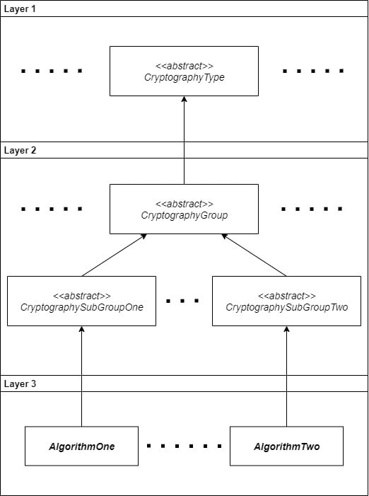



### {:.book_mark}Cryptography Model Overview ###

&nbsp;&nbsp;&nbsp;&nbsp;The **CryptoMañana (CryptoManana) cryptography framework** provides an object-oriented
cryptography model that is fully extensible and reusable. The cryptography system implements an extensible pattern of
derived class inheritance based on a three layer separation of the defined object model. Each layer has its own semantic
role in the building of hierarchies for cryptographic primitives, protocols and services. The specification of each
layer is as follows:

- The cryptography algorithm type class, such as AbstractSymmetricEncryptionAlgorithm, which defines a fully abstract
  specification level. This layer distinguishes and describes the different types of cryptography;
- The subtype of the cryptography algorithm family/group that inherits from an algorithm base type, such as
  AbstractBlockCipherAlgorithm or AbstractStreamCipherAlgorithm. This level is abstract and can be divided in multiple
  internal hierarchy layers to cover the needs of the specific subgroups and may contain some reusable functionalities;
- The implementation of a cryptography algorithm class that inherits from a subtype algorithm class, for example AES-256
  or RC4. This level is fully implemented and may provide backward compatibility features depending on the current
  platform.

&nbsp;&nbsp;&nbsp;&nbsp;This cryptography model specification is based on a pattern of derived classes divided in
different levels. It enabled you to add a new algorithm type, subtype or a specific new implementation of an existing
algorithm in a convenient, easy and unified way. For example, if some new cryptography type emerged for global usage (
for example "quick" enough quantum cryptography functionality), the model will easily add a new abstraction at level one
and define the next two layers accordingly to the needs of the type. Another case would be, if there is a fresh new
group of algorithms specified for an existing cryptography type that was previously not supported by the platform, then
we would just need to extend the layer one type and define as many as needed abstractions at layer two. A practical
example would be the key stretching group of the cryptography type for hash algorithms, where the level one
AbstractHashAlgorithm class is extended at layer two and defines a AbstractKeyStretchingFunction specification. The key
stretching group type splits into two derived abstractions as the AbstractKeyMaterialDerivationFunction for fast
multiple key generation and the AbstractPasswordBasedDerivationFunction for hardware-resistant password digestion. The
last layer would then contain only the specific standard implementation of a cryptography algorithm, protocol or
service. At this final level, if a new cutting-edge standard emerges, it would be created under the group which it
belongs via the implemented cryptography model specific hierarchy set. As an example, to create an AES-256
implementation, the developer would extend the AbstractBlockCipherAlgorithm class and inherit some algorithm features
for fast reuse. This model allows the developer to easily define more subtypes at the second level or temporary override
an implementation to fix bugs and compatibility problems. The overview of the defined cryptography model by layers can
be seen at Figure 1.

{: .centered_item}

*Figure 1: The CryptoManana cryptography model.*
{: .centered_item}

&nbsp;&nbsp;&nbsp;&nbsp;This cryptography model as a non-platform dependent theoretical solution that gives the
developer enough flexibility and provides a unified approach to manage the implementation of cryptography primitives,
protocols, services and processing techniques. Also, the actual components supply a ready set of standardized
cryptography algorithms and services for direct usage by the software engineer. The **CryptoManana framework**
implements a cryptography model for PHP that was developed with the aim to create a better practical object-oriented
solution than
the [.NET Cryptography Model](https://docs.microsoft.com/en-us/dotnet/standard/security/cryptography-model) or
the [Java Cryptography Architecture](https://docs.oracle.com/javase/8/docs/technotes/guides/security/crypto/CryptoSpec.html)
offers to the software engineers and architects. In addition, the framework was designed to have more features than the
best available procedural functions at language level or the native realization available at 3rd party libraries.

### {:.book_mark}Cryptographic Configuration ###

&nbsp;&nbsp;&nbsp;&nbsp;The configuration of cryptography primitives in the CryptoManana Framework is done via setter
methods that are created as a fluent interface and whose design relies extensively on chaining. In addition, the
cryptography services and protocols rely on the passing of primitives via a basic dependency injection approach. The
container style realization also supports a direct fluent interface to all the injected internal dependencies, which
saves the trouble of getting an internal component, reconfiguring it and injecting it again into the cryptography
service. The minimum requirements for all created cryptographic services are explicitly stated in the initialization
process of the component. In addition, because of the various needs of the different cryptographic services, the
framework has created a flexible dictionary data structure for representing custom input, output or configuration
formats. This enabled the developer to easily reuse the base code of the storage object and create his own protocol
specification format for usage.

&nbsp;&nbsp;&nbsp;&nbsp;To make the life of the common developer even easier, the default configuration parameters or
object dependencies are always pointed to the most secure available (when possible). This can save some tuning time and
minimizes the risk of insecure implicit configuration usages from copy-paste style engineers. In addition, the framework
provides a set of factory components that make the initialization and the configuration of all implemented cryptography
primitives and services even easier. All components are forced to use strictly defined framework exceptions and other
core components, such as a string builder object, but we will revise their usage in another section of the
documentation. The design of the framework, forces common features or validations to be kept as a separate trait
implementation, which is based on an interface specification, so that the future defining of new cryptography
realizations at layer three would become even easier, because of the existing amount of re-usable code. Further more,
every component or method is fully documented via PHPDocs and provides a developer-friendly IDE stubs autocompletion
function.


