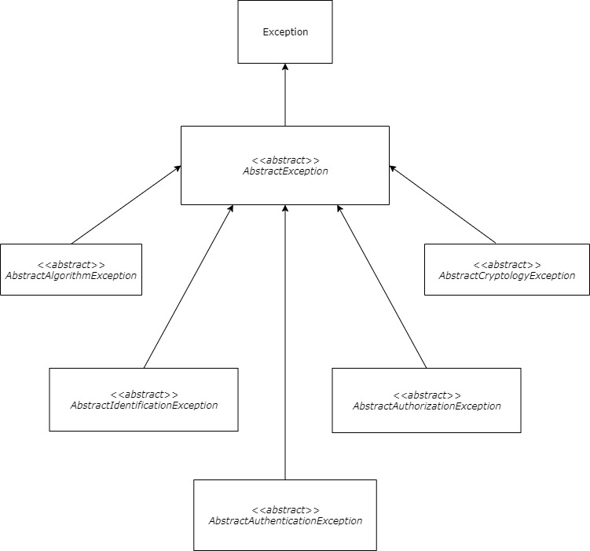



### [](#cryptographic-model-exceptions){:.book_mark}Cryptographic Model Exceptions ###

&nbsp;&nbsp;&nbsp;&nbsp;The software framework supports custom exceptions at the developed cryptography model. They are
needed for the existing component realizations and for the future ones to come. The developer can use them in the
cryptographic context for marking process, protocol or other errors.

&nbsp;&nbsp;&nbsp;&nbsp;The **CryptoMañana (CryptoManana) cryptography framework** provides all available cryptographic
model exceptions at the [`\CryptoManana\Exceptions`](../api/namespaces/CryptoManana.Exceptions.html "exceptions"){:
target="_blank"} namespace. Here is a list of all custom error components:

- `AccessDeniedException` - For marking access denied per attempt;
- `AuthenticationFailureException` - For marking authentication errors;
- `AuthorizationFailureException` - For marking authorization errors;
- `BadPracticeException` - For marking bad security practices;
- `BotDetectedException` - For marking users as bots;
- `BreachAttemptException` - For marking security breach attempts;
- `CryptographyException` - For marking cryptography errors;
- `IdentificationFailureException` - For marking identification errors;
- `IncompatibleException` - For marking backward incompatible usages;
- `InsecureUsageException` - For marking insecure usage cases;
- `MaliciousPayloadException` - For marking malicious payload requests;
- `SessionExpiredException` - For marking expired session errors;
- `TokenExpiredException` - For marking expired access token errors;
- `UnsupportedException` - For marking unsupported algorithms;
- `WrongConfigurationException` - For marking wrong configuration errors.

&nbsp;&nbsp;&nbsp;&nbsp;Each error object extends the `AbstractException`
base exception specification and is derived from the default PHP `\Exception` object. This type of exception object is
fully configurable before throwing (in contrast to the default one) and has a `INTERNAL_CODE` constant for the actual
framework error, that is said ot the objects `code` property. You can get the framework internal code via
the `getFrameworkErrorCode()` even if you decide to add a custom error code to the object. The following custom method
are available:

```php
getFrameworkErrorCode() // gets the internal error code
setMessage() // set a custom message
setCode() // set a custom code
setFile() // set a custom file name
setLine() // set a custom line
```

&nbsp;&nbsp;&nbsp;&nbsp;This type of component has 1 public constant available:

```php
INTERNAL_CODE // the framework internal error code
```

&nbsp;&nbsp;&nbsp;&nbsp;Here is a simple example for the usage of this type of secure data service component:



```php
use CryptoManana\Exceptions\CryptographyException;

$exception = new CryptographyException();

$exception->setCode(500)
    ->setMessage('Wrong key at server!')
    ->setLine(3)
    ->setFile(__FILE__);

echo 'Framework Error Code: ' . $exception->getFrameworkErrorCode() . '<br>';
echo 'Error Code: ' . $exception->getCode() . '<br>';
echo 'Error Message: ' . $exception->getMessage() . '<br>';
echo 'Error Line: ' . $exception->getLine() . '<br>';
echo 'Error File: ' . $exception->getFile() . '<br>';

echo 'Throwing it for testing purposes: ' . '<br>';

throw $exception;
```

### [](#the-object-hierarchy){:.book_mark}The Object Hierarchy ###

&nbsp;&nbsp;&nbsp;&nbsp;The internal components' hierarchy is visualized as a technical diagram and can be seen at
Figure 1.

{:
.centered_item}

*Figure 1: The framework exception components hierarchy.*{: .centered_item}

&nbsp;&nbsp;&nbsp;&nbsp;For more information about the capabilities of the components, please see the technical
documentation for
[`\CryptoManana\Exceptions`](../api/namespaces/CryptoManana.Exceptions.html "Exception namespace"){:target="_blank"}
namespace.

