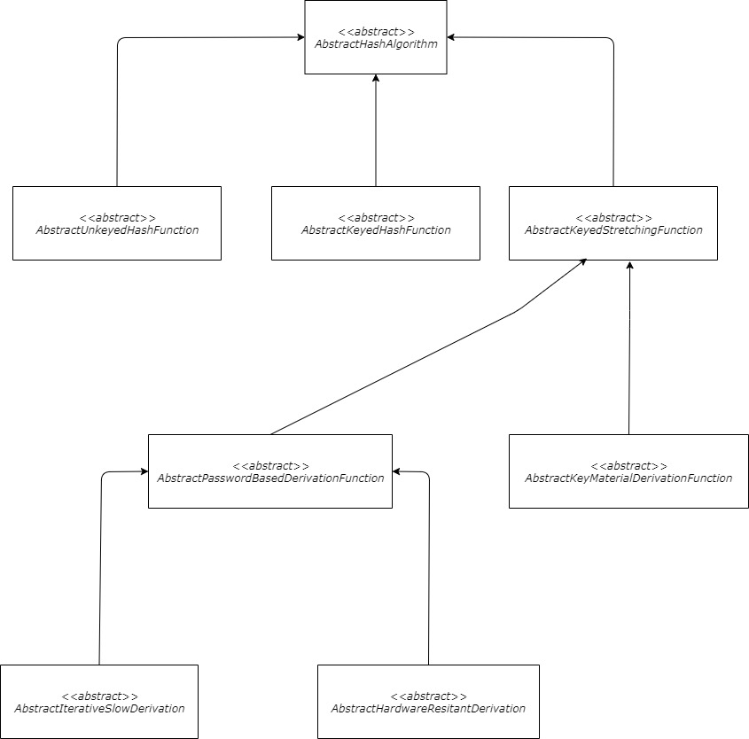



### [](#hash-function){:.book_mark}Hash Function ###

&nbsp;&nbsp;&nbsp;&nbsp;The definition of a hash function is any function that can be used to map data of arbitrary size
to fixed-size values. The output values returned by this type of function are called hash values, hash codes, digests or
simply hashes. In addition, a cryptographic hash function is an algorithm that takes an arbitrary amount of data, for
example user credentials, and produces a fixed-size output of one way enciphered text called a hash value. That
encrypted text can then be stored instead of the password itself and be used to verify the user. This output digest acts
as a secure checksum of the input data or file, and can be used to verify the integrity of the data, authenticate the
ownership or verify the source of the file. Cryptographic hash functions can have a lot of different parameters,
depending on their type. They are frequently used with a cryptographic salt that is made up of pseudo-random bits that
are added in some way to the input, in order to increase the resistance of the function against various attacks to
compromise the used digestion algorithm. The use cases of this type of cryptographic calculation is tremendous, the
input digestion algorithms are mostly used for:

- Data integrity checks;
- Source authentication;
- Generation of a huge set of keys;
- Secure password storage and verification;
- Digital signature verification;
- Others.

&nbsp;&nbsp;&nbsp;&nbsp;The **CryptoMañana (CryptoManana) cryptography framework** provides object-oriented components
for each of the above use cases and has a huge set of available realizations.

### [](#basic-methods){:.book_mark}Basic Methods ###

&nbsp;&nbsp;&nbsp;&nbsp;The provided software components for hashing in the cryptography model always include:

```php
hashData() // hash a string of binary data
setSalt() // set the salting string
getSalt() // get the current salting string
setSaltingMode() // set a salting operation mode
getSaltingMode() // get the current salting operation mode
setDigestFormat() // set a output format for the digest string
getDigestFormat() // get the current output digest string presentation format
```

### [](#input-salting-techniques){:.book_mark}Input Salting Techniques ###

&nbsp;&nbsp;&nbsp;&nbsp;As mentioned previously, the adding of a cryptographic salt string or a nonce to the input can
increase the overall security of a hash function (if done correctly). This cryptography framework provides 9 salting
techniques that can be easily configured. The specific techniques can be enabled via the `setSaltingMode()` setter
method (the default setting is `SALTING_MODE_APPEND`) and the available mode constants per each object. The following
options are available for each object:

- `SALTING_MODE_NONE` - Disable the usage of a salting technique (even if one has been set via the `setSalt()` method);
- `SALTING_MODE_APPEND` - **This is the default salting mode** that implements a simple append of the salting value to
  the input data (meaning `dataSALT`);
- `SALTING_MODE_PREPEND` - Implementation of a simple prepend operation of the salting value (meaning `SALTdata`);
- `SALTING_MODE_INFIX_INPUT` - An advanced mode that prepends the data and appends a revered salting value (
  meaning `SALTdataTLAS`);
- `SALTING_MODE_INFIX_SALT` - Similar to the above method, but appends the salting string and places a reversed data
  string at the end (meaning `dataSALTatad`);
- `SALTING_MODE_REVERSE_APPEND` - Reverses the salt string before appending it (meaning `dataTLAS`);
- `SALTING_MODE_REVERSE_PREPEND` - Reverses the salt string before prepending it (meaning `TLASdata`);
- `SALTING_MODE_DUPLICATE_SUFFIX` - Creates a suffix via the original salting value and its reversed version (
  meaning `dataSALTTLAS`);
- `SALTING_MODE_DUPLICATE_PREFIX` - Creates a suffix via the original salting value and its reversed version (
  meaning `SALTTLASdata`);
- `SALTING_MODE_PALINDROME_MIRRORING` - Uses the input, the salt and their reverse formes to create a readable
  palindrome word (meaning `SALTdataatadTLAS`).

### [](#output digestion format){:.book_mark}Output Digestion Format ###

&nbsp;&nbsp;&nbsp;&nbsp;The software framework supports a vast variety of well-know and frequently used data formats for
the output digest value. Each hash function object provides 5 output formats that can be easily configured. The specific
format can be enabled via the `setDigestFormat()` setter method (the default setting is `DIGEST_OUTPUT_HEX_UPPER`) and
the available format setting constants per each object. The following options are available for each object:

- `DIGEST_OUTPUT_RAW` - The raw byte string representation, used by PHP for working with byte arrays (for
  example `�5�a`);
- `DIGEST_OUTPUT_HEX_UPPER` -  **This is the default salting mode** that uses the most popular uppercase HEX
  representation (for example `DB35`);
- `DIGEST_OUTPUT_HEX_LOWER` - The lowercase HEX outputting format (for example `8f36`);
- `DIGEST_OUTPUT_BASE_64` - The Base64 standard string representation (for example `C3gGTA==`);
- `DIGEST_OUTPUT_BASE_64_URL` - The Base64 URL friendly string format (for example `C3gGTA`).

### [](#unkeyed-hash-functions){:.book_mark}Unkeyed Hash Functions ###

&nbsp;&nbsp;&nbsp;&nbsp;The first supported type is the unkeyed hash function that has no parameters and is mostly used
for data integrity checks. The supported algorithm/standard realizations at the
[`\CryptoManana\Hashing`](../api/namespaces/CryptoManana.Hashing.html "The data digestion namespace"){:target="_blank"}
namespace are:

- `Md5` - The MD5 implementation cryptography primitive;
- `Sha1` - The SHA-1 implementation cryptography primitive;
- `ShaTwo224` - The SHA-2 family SHA-224 implementation cryptography primitive;
- `ShaTwo256` - The SHA-2 family SHA-256 implementation cryptography primitive;
- `ShaTwo384` - The SHA-2 family SHA-384 implementation cryptography primitive;
- `ShaTwo512` - The SHA-2 family SHA-512 implementation cryptography primitive;
- `ShaThree224` - The SHA-3 family SHA-224 implementation cryptography primitive;
- `ShaThree256` - The SHA-3 family SHA-256 implementation cryptography primitive;
- `ShaThree384` - The SHA-3 family SHA-384 implementation cryptography primitive;
- `ShaThree512` - The SHA-3 family SHA-512 implementation cryptography primitive;
- `Ripemd128` - The RIPEMD-128 implementation cryptography primitive;
- `Ripemd160` - The RIPEMD-160 implementation cryptography primitive;
- `Ripemd256` - The RIPEMD-256 implementation cryptography primitive;
- `Ripemd320` - The RIPEMD-320 implementation cryptography primitive;
- `Whirlpool` - The Whirlpool implementation cryptography primitive.

&nbsp;&nbsp;&nbsp;&nbsp;It is important mention that the unkeyed hash components have 3 other methods available:

```php
hashFile() // calculate a hash value for a file's content
hashObject() // calculate a hash value for an object's serialization state
repetitiveHashData() // do reparative hashing, like md5(md5('1234'))
```

&nbsp;&nbsp;&nbsp;&nbsp;Here is a simple example for the usage of this type of hashing component:



```php
use CryptoManana\Hashing\Sha1;
use \stdClass as stdClass;

$hasher = new Sha1();

$hasher->setSalt('SALT')
    ->setSaltingMode($hasher::SALTING_MODE_INFIX_INPUT) // or `Sha1::`
    ->setDigestFormat($hasher::DIGEST_OUTPUT_BASE_64_URL); // or `Sha1::`

// sha1('SALTdataTLAS')
echo 'Text Digest: ' . $hasher->hashData('data') . PHP_EOL;

// sha1(sha1(sha1())))
echo '3x Digestion: ' . $hasher->repetitiveHashData('data', 3) . PHP_EOL;

// has the content of this file
echo 'File Digest: ' . $hasher->hashFile(__FILE__) . PHP_EOL;

// serialize and hash an empty object
echo 'Object Digest: ' . $hasher->hashObject(new stdClass()) . PHP_EOL;
```

### [](#keyed-hash-functions){:.book_mark}Keyed Hash Functions ###

&nbsp;&nbsp;&nbsp;&nbsp;The second supported type is the keyed hash function that has an extra parameter for the
calculation in the form of a key and is mostly used for data authentication checks or for password storage purposes. The
supported algorithm/standard realizations at the
[`\CryptoManana\Hashing`](../api/namespaces/CryptoManana.Hashing.html "The data digestion namespace"){:target="_blank"}
namespace are:

- `HmacMd5` - The HMAC-MD5 implementation cryptography primitive;
- `HmacSha1` - The HMAC-SHA-1 implementation cryptography primitive;
- `HmacShaTwo224` - The SHA-2 family HMAC-SHA-224 implementation cryptography primitive;
- `HmacShaTwo256` - The SHA-2 family HMAC-SHA-256 implementation cryptography primitive;
- `HmacShaTwo384` - The SHA-2 family HMAC-SHA-384 implementation cryptography primitive;
- `HmacShaTwo512` - The SHA-2 family HMAC-SHA-512 implementation cryptography primitive;
- `HmacShaThree224` - The SHA-3 family HMAC-SHA-224 implementation cryptography primitive;
- `HmacShaThree256` - The SHA-3 family HMAC-SHA-256 implementation cryptography primitive;
- `HmacShaThree384` - The SHA-3 family HMAC-SHA-384 implementation cryptography primitive;
- `HmacShaThree512` - The SHA-3 family HMAC-SHA-512 implementation cryptography primitive;
- `HmacRipemd128` - The HMAC-RIPEMD-128 implementation cryptography primitive;
- `HmacRipemd160` - The HMAC-RIPEMD-160 implementation cryptography primitive;
- `HmacRipemd256` - The HMAC-RIPEMD-256 implementation cryptography primitive;
- `HmacRipemd320` - The HMAC-RIPEMD-320 implementation cryptography primitive;
- `HmacWhirlpool` - The HMAC-Whirlpool implementation cryptography primitive.

&nbsp;&nbsp;&nbsp;&nbsp;It is important mention that the keyed hash components have 6 other methods available:

```php
hashFile() // calculate a hash value for a file's content
hashObject() // calculate a hash value for an object's serialization state
repetitiveHashData() // do reparative hashing, like md5(md5('1234'))
verifyHash() // time-safe verification of a digest against an input (@passwords)
setKey() // setter for the HMAC key
getKey() // getter for the HMAC key
```

&nbsp;&nbsp;&nbsp;&nbsp;Here is a simple example for the usage of this type of hashing component:



```php
use CryptoManana\Hashing\HmacSha1;
use \stdClass as stdClass;

$hasher = new HmacSha1();

$hasher->setKey('manana')
	->setSalt('4321')
	->setDigestFormat($hasher::DIGEST_OUTPUT_HEX_LOWER) // or `HmacSha1::`
	->setSaltingMode($hasher::SALTING_MODE_INFIX_SALT); // or `HmacSha1::`

$digest = $hasher->hashData('password');

echo $hasher->verifyHash('password', $digest) ?
    'The passwords match!' : 'The passwords are not the same!';
echo PHP_EOL;

// hmacsha1('SALTdataTLAS')
echo 'Text Digest: ' . $hasher->hashData('data') . PHP_EOL;

// hmacsha1(hmacsha1(hmacsha1())))
echo '3x Digestion: ' . $hasher->repetitiveHashData('data', 3) . PHP_EOL;

// has the content of this file
echo 'File Digest: ' . $hasher->hashFile(__FILE__) . PHP_EOL;

// serialize and hash an empty object
echo 'Object Digest: ' . $hasher->hashObject(new stdClass()) . PHP_EOL;

$hasher->setKey('first key');
$digestOne = $hasher->hashData('data');

$hasher->setKey('second key');
$digestTwo = $hasher->hashData('data');

echo $digestOne === $digestTwo ?
    'The too digest are the same!' : 'The digests are different, CORRECT!';
````

### [](#key-derivation-hash-functions){:.book_mark}Key Derivation Hash Functions ###

&nbsp;&nbsp;&nbsp;&nbsp;The third supported type is the key derivation hash function that can have multiple extra
parameters and is mostly used for the generation of huge sets of connected keys, data authentication checks or for
secure dynamic configuration manipulations ("transforming before using"). The best feature for this type of hash
function is that we can choose the output length of the digest based on the chosen algorithm. The supported
algorithm/standard realizations at the
[`\CryptoManana\Hashing`](../api/namespaces/CryptoManana.Hashing.html "The data digestion namespace"){:target="_blank"}
namespace are:

- `HkdfMd5` - The HKDF-MD5 implementation cryptography primitive;
- `HkdfSha1` - The HKDF-SHA-1 implementation cryptography primitive;
- `HkdfShaTwo224` - The SHA-2 family HKDF-SHA-224 implementation cryptography primitive;
- `HkdfShaTwo256` - The SHA-2 family HKDF-SHA-256 implementation cryptography primitive;
- `HkdfShaTwo384` - The SHA-2 family HKDF-SHA-384 implementation cryptography primitive;
- `HkdfShaTwo512` - The SHA-2 family HKDF-SHA-512 implementation cryptography primitive;
- `HkdfShaThree224` - The SHA-3 family HKDF-SHA-224 implementation cryptography primitive;
- `HkdfShaThree256` - The SHA-3 family HKDF-SHA-256 implementation cryptography primitive;
- `HkdfShaThree384` - The SHA-3 family HKDF-SHA-384 implementation cryptography primitive;
- `HkdfShaThree512` - The SHA-3 family HKDF-SHA-512 implementation cryptography primitive;
- `HkdfRipemd128` - The HKDF-RIPEMD-128 implementation cryptography primitive;
- `HkdfRipemd160` - The HKDF-RIPEMD-160 implementation cryptography primitive;
- `HkdfRipemd256` - The HKDF-RIPEMD-256 implementation cryptography primitive;
- `HkdfRipemd320` - The HKDF-RIPEMD-320 implementation cryptography primitive;
- `HkdfWhirlpool` - The HKDF-Whirlpool implementation cryptography primitive.

&nbsp;&nbsp;&nbsp;&nbsp;It is important mention that the key derivation hash components have 7 other methods available:

```php
repetitiveHashData() // do reparative hashing, like md5(md5('1234'))
setDerivationSalt() // set the internal derivation salt (for internal hashing)
getDerivationSalt() // get the current internal derivation salt
setContextualString() // set a key for the derivation (parallel execution)
getContextualString() // get the contextual string key
setOutputLength() // set a desired output length in bytes
getOutputLength() // get the currently set output length
```

&nbsp;&nbsp;&nbsp;&nbsp;Here is a simple example for the usage of this type of hashing component:



```php
use CryptoManana\Hashing\HkdfSha1;

$hasher = new HkdfSha1();

$hasher->setDigestFormat($hasher::DIGEST_OUTPUT_RAW) // or `HkdfSha1::`
	->setSaltingMode($hasher::SALTING_MODE_APPEND) // or `HkdfSha1::`
	->setSalt('hit hard');

$hasher->setContextualString('crypto')
	->setDerivationSalt('manana')
	->setOutputLength(69);

$digestOne = $hasher->hashData('data');

$hasher->setContextualString('cryptomanana');
$digestTwo = $hasher->hashData('data');

echo $digestOne === $digestTwo ?
    'The too digest are the same!' : 'The digests are different, CORRECT!';
echo PHP_EOL;

echo 'Text Digest: ' . $digestOne . PHP_EOL;

$hasher->setContextualString('cryptomanana');
echo 'Text Digest (different context): ' . $digestTwo . PHP_EOL;

// hkdfsha1(hkdfsha1(hkdfsha1()))
echo '3x Digestion: ' . $hasher->repetitiveHashData('data', 3) . PHP_EOL;
```

### [](#password-derivation-hash-functions){:.book_mark}Password Derivation Hash Functions ###

&nbsp;&nbsp;&nbsp;&nbsp;The fourth supported type is the password-based derivation hash function that has multiple extra
parameter for the calculation and is mostly used to protect passwords that need a hardware or parallel resistance
defence. The used configurations with this type of function **should aim a hashing time above 50 milliseconds for web
based applications** or up to 0.5 seconds for other purposes. It is important to say that the output digest here can be
of different length, because some of the algorithms (like Argon2 or Bcrypt) can have a different salting string for each
operation and also support a version of the algorithms used (inside the digest). The supported algorithm/standard
realizations at the
[`\CryptoManana\Hashing`](../api/namespaces/CryptoManana.Hashing.html "The data digestion namespace"){:target="_blank"}
namespace are:

- `Pbkdf2Md5` - The PBKDF2-MD5 implementation cryptography primitive;
- `Pbkdf2Sha1` - The PBKDF2-SHA-1 implementation cryptography primitive;
- `Pbkdf2ShaTwo224` - The SHA-2 family PBKDF2-SHA-224 implementation cryptography primitive;
- `Pbkdf2ShaTwo256` - The SHA-2 family PBKDF2-SHA-256 implementation cryptography primitive;
- `Pbkdf2ShaTwo384` - The SHA-2 family PBKDF2-SHA-384 implementation cryptography primitive;
- `Pbkdf2ShaTwo512` - The SHA-2 family PBKDF2-SHA-512 implementation cryptography primitive;
- `Pbkdf2ShaThree224` - The SHA-3 family PBKDF2-SHA-224 implementation cryptography primitive;
- `Pbkdf2ShaThree256` - The SHA-3 family PBKDF2-SHA-256 implementation cryptography primitive;
- `Pbkdf2ShaThree384` - The SHA-3 family PBKDF2-SHA-384 implementation cryptography primitive;
- `Pbkdf2ShaThree512` - The SHA-3 family PBKDF2-SHA-512 implementation cryptography primitive;
- `Pbkdf2Ripemd128` - The PBKDF2-RIPEMD-128 implementation cryptography primitive;
- `Pbkdf2Ripemd160` - The PBKDF2-RIPEMD-160 implementation cryptography primitive;
- `Pbkdf2Ripemd256` - The PBKDF2-RIPEMD-256 implementation cryptography primitive;
- `Pbkdf2Ripemd320` - The PBKDF2-RIPEMD-320 implementation cryptography primitive;
- `Pbkdf2Whirlpool` - The PBKDF2-Whirlpool implementation cryptography primitive;
- `Argon2` - The Argon2 implementation cryptography primitive;
- `Bcrypt` - The Bcrypt implementation cryptography primitive.

&nbsp;&nbsp;&nbsp;&nbsp;It is important mention that the Password-Based Key Derivation (version 2) components have 7
other methods available:

```php
verifyHash() // time-safe verification of a digest against an input (@passwords)
setDerivationSalt() // set the internal derivation salt (for internal hashing)
getDerivationSalt() // get the current internal derivation salt
setOutputLength() // set a desired output length in bytes
getOutputLength() // get the currently set output length
setDerivationIterations() // set the internal iteration values
getDerivationIterations() // get the current iteration value
```

&nbsp;&nbsp;&nbsp;&nbsp;The Bcrypt standard implementation component has 3 other methods available:

```php
verifyHash() // time-safe verification of a digest against an input (@passwords)
setAlgorithmicCost() // set the algorithmic cost (strength of operation)
getAlgorithmicCost() // get the algorithmic cost (strength of operation)
```

&nbsp;&nbsp;&nbsp;&nbsp;The Argon2 standard implementation component has 9 other methods available:

```php
verifyHash() // time-safe verification of a digest against an input (@passwords)
setMemoryCost() // set the memory cost
getMemoryCost() // get the memory cost
setTimeCost() // set the time cost
getTimeCost() // get the time cost
setThreadsCost() // set the thread cost
getThreadsCost() // get the thread cost
setAlgorithmVariation() // set the algorithm version (VERSION_I or VERSION_ID)
getAlgorithmVariation() // get the algorithm version
```

*Note: The Argon2i is supported in PHP >= 7.2.0 and the Argon2id is supported in PHP >= 7.3.0 (for security reasons).

&nbsp;&nbsp;&nbsp;&nbsp;Here is a simple example for the usage of the PBKDF2 type of hashing component:

```php
use CryptoManana\Hashing\Pbkdf2Sha1;

$hasher = new Pbkdf2Sha1();

$hasher->setDigestFormat($hasher::DIGEST_OUTPUT_HEX_LOWER) // or `Pbkdf2Sha1::`
	->setSaltingMode($hasher::SALTING_MODE_APPEND) // or `Pbkdf2Sha1::`
	->setSalt('hit hard');

$hasher->setDerivationIterations(100000)
	->setOutputLength(20)
	->setDerivationSalt('manana');

$start = microtime(true);

$digest = $hasher->hashData('password');

$end = round((double)microtime(true) - $start, 4);
$end = number_format($end, 4, '.', '');

echo $hasher->verifyHash('password', $digest) ?
    'The passwords match!' : 'The passwords are not the same!';
echo PHP_EOL;

echo 'Text Digest: ' . $digest . PHP_EOL;

echo "Time: $end seconds";
```

&nbsp;&nbsp;&nbsp;&nbsp;Here is a simple example for the usage of the Bcrypt type of hashing component:

```php
use CryptoManana\Hashing\Bcrypt;

$hasher = new Bcrypt();

$hasher->setDigestFormat($hasher::DIGEST_OUTPUT_RAW) // or `Bcrypt::`
	->setSaltingMode($hasher::SALTING_MODE_APPEND) // or `Bcrypt::`
	->setSalt('hit hard');

$hasher->setAlgorithmicCost(8);

$start = microtime(true);

$digest = $hasher->hashData('password');

$end = round((double)microtime(true) - $start, 4);
$end = number_format($end, 4, '.', '');

echo $hasher->verifyHash('password', $digest) ?
    'The passwords match!' : 'The passwords are not the same!';
echo PHP_EOL;

echo 'Text Digest: ' . $digest . PHP_EOL;

echo "Time: $end seconds";
```

&nbsp;&nbsp;&nbsp;&nbsp;Here is a simple example for the usage of the Argon2 type of hashing component:

```php

use CryptoManana\Hashing\Argon2;

$hasher = new Argon2();

$hasher->setDigestFormat($hasher::DIGEST_OUTPUT_RAW) // or `Argon2::`
	->setSaltingMode($hasher::SALTING_MODE_APPEND) // or `Argon2::`
	->setSalt('hit hard');

// PHP >= 7.3 (or 7.2 for VERSION_I)
$hasher->setAlgorithmVariation($hasher::VERSION_ID)
	->setTimeCost(5)
	->setMemoryCost(1024)
	->setThreadsCost(8);

$start = microtime(true);

$digest = $hasher->hashData('password');

$end = round((double)microtime(true) - $start, 4);
$end = number_format($end, 4, '.', '');

echo $hasher->verifyHash('password', $digest) ?
    'The passwords match!' : 'The passwords are not the same!';
echo PHP_EOL;

echo 'Text Digest: ' . $digest . PHP_EOL;

echo "Time: $end seconds";
```

*Note: Because the configuration here can be tricky, you can use a tool
like [Kratos](https://www.ory.sh/kratos/docs/guides/setting-up-password-hashing-parameters/){:target="_blank"} to choose
a secure one.*

### [](#the-object-hierarchy){:.book_mark}The Object Hierarchy ###

&nbsp;&nbsp;&nbsp;&nbsp;The internal components' hierarchy is visualized as a technical diagram and can be seen at
Figure 1.

{: .centered_item}

*Figure 1: The data digestion components hierarchy.*{: .centered_item}

&nbsp;&nbsp;&nbsp;&nbsp;For more information about the capabilities of the components, please see the technical
documentation for
the [`\CryptoManana\Hashing`](../api/namespaces/CryptoManana.Hashing.html "The data digestion namespace"){:target="_
blank"} namespace.


