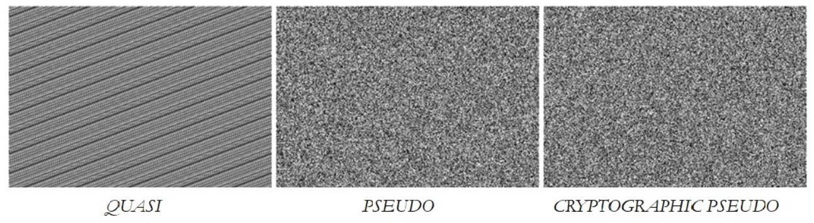



### [](#randomness-sources){:.book_mark}Randomness Source ###

&nbsp;&nbsp;&nbsp;&nbsp;The general language definition of randomness is the absence of a pattern or any predictability
in an event. The random sequence of events, symbols or steps must also be unpredictable or without any visible
combination order. Frequently, when testing with a huge amount of unpredictable events, also known as trials, patterns
may still appear. An example of this may be the throwing of dice or a coin multiple times until revealing some
probability model or repeated behavior.

&nbsp;&nbsp;&nbsp;&nbsp;In mathematics and statistics, a random variable is an assignment of a numerical value to each
possible outcome of an event scope or domain. This makes it possible to calculate a probability value for each valid
event. When applying this scientific view, randomness becomes a valid measure of uncertainty or even applies a concept
of chance in an outcome. There are many applications, such as the evaluation of the information entropy of a message by
assigning a higher information rate to lower-probability events and finding the low-level building blocks in huge data
samples. This way we can use it also as a measure of disorder in a system or a type of uncertainty associated with a
random variable in a certain domain. The realization of practical randomness sources in computational science and
software technologies relies completely on number theory algorithms and the building of random enough looking number
sequences. Most of them rely on the current system time with a combination of binary operations between numbers in a
certain valid domain. These algorithms have the ability to produce the same output by setting a custom value on
initialization, also known as an initial seed or just seed.

&nbsp;&nbsp;&nbsp;&nbsp;As a term in computer science, randomness is considered as noise, which represents some
irrelevant or meaningless data. Having this said, some high-quality algorithms are initialized with values generated by
radio waves caused from magnetic reconnections of the computer’s hardware devices, such as the central processing unit
or the hard disk drive, etc. Operating systems make such low-level data accessible via the kernel’s software drivers as
a source of noise that has higher entropy and can make the used mathematical algorithms far more unpredictable. Even
though the generated noise is still limited to the byte event space, it is a lot harder to guess it and is immune to
logical attacks. Having this said, even if the used noise sources seem to be truly unpredictable, with time some of them
will be scientifically explained and will no longer be looked upon as random. This can make our systems vulnerable to
new zero-day attacks in the near future but also provides an easy mitigation method by just switching to another source
or generation algorithm. Philosophically said, everything is random until we find an explanation and can reproduce the
exact logic of the given process.

### [](#software-randomness-generators){:.book_mark}Software Randomness Generators ###

&nbsp;&nbsp;&nbsp;&nbsp;In computer systems, given randomness sources are being harvested to create randomness
generators. These generators are implementing a process generating an internal sequence of numbers, symbols or bytes and
in some cases allow the sequence to be repeatable by passing the same initial configuration value. These type of
algorithms tend to generate output that cannot be reasonably or easily predicted. They are used to simulate a certain
type of randomness and generate different random-looking output data formats. These algorithms are decided into two
categories:

- Hardware Random Number Generator (HRNG) or "True Random" Number Generator (TRNG) - a device that generates random
  numbers from an unpredictable physical process, rather than by means of an algorithm or process;
- Pseudo-random Number Generators (PRNG) or "software pseudo-random" number generator - a software algorithm for
  producing statistically "random looking" sequences, that can either be controlled by a seed value or be uncontrollable
  by harvesting a hardware randomness source for security purposes.

&nbsp;&nbsp;&nbsp;&nbsp;The HRNG type is mostly available via a 3<sup>rd</sup> party hardware chip sold from certain
vendors or as a high-entropy source embedded source, such
as [Intel Digital Random Number Generator (DRNG)](https://software.intel.com/content/www/us/en/develop/articles/intel-digital-random-number-generator-drng-software-implementation-guide.html){:
target="_blank" } hardware implementation. In most practical use cases, these types of randomness sources are combined
with certain secure pseudo-randomness software algorithms and are rarely used as a standalone solution. The software
algorithms for PRNG are divided in three main branches of the software random data generator realizations:

- Quasi-random number generator (QRNG) - is a sub-random generator that produce a low-discrepancy sequence and uniformly
  distribute the number of points. They fail on most statistical tests for simulating randomness, but cover or fill the
  domain more evenly and quite faster that other algorithms. They tend to be very useful in financial mathematics and
  data mining algorithms;
- Pseudo-random number generator (PRNG) - is a generator that creates random enough looking sequences can pass
  statistical randomness tests. They strive to be virtually close enough to true randomness by not having any
  recognizable patterns or visible order, but can be fully controllable. They are very useful in the realization of
  computer simulations, statistical analysis, shuffling algorithms, data mocking and software testing;
- Cryptography secure pseudo-random number generator (CSPRNG) - is a realization of a pseudo-randomness number generator
  that is suitable for cryptography purposes, cybersecurity defenses and network protocol algorithms. They pass
  statistical tests for simulating randomness, can not be controllable in any way and are immune to attacks, even if the
  attacker knows the initial state passed to the algorithm or the consumed entropy pool location. They harvest the full
  force of high-quality sources of noise via the operating system’s kernel.

&nbsp;&nbsp;&nbsp;&nbsp;The QRNG and PRNG types support the ability to repeat the same output result via an
initialization value for the internal generation algorithm, also known as a seed value. This makes them perfect for
software testing but not good enough for building secure software. The CSPRNG does not support seeding and is designed
to be used for cryptography related purposes. Such as data erasure standards or for the secure generation of unique
identifiers, tokens, keys, salts, nonces, etc. The cryptography secure pseudo-random number generators are designed to
harvest the highest quality entropy source of randomness available, such as a HRNG chip or a DRNG implementation, and be
safe even in parallel computations. The security of cryptography services, protocols and techniques relies entirely on
the grade of the used pseudo-randomness generator. To illustrate the difference in the generation quality of each
software pseudo-random number generator, three black*&*white pictures have been generated by harvesting the output of
each type and can be seen at Figure 1.

{: .centered_item}

*Figure 1: Visual comparison of QRNG, PRNG and CSPRNG.*{: .centered_item}

&nbsp;&nbsp;&nbsp;&nbsp;As we can see from the results, the quasi-randomness algorithm correctly differs from the other
two types because of its uniformly distributed numerical set. The chaotic output of both the pseudo-randomness and the
secure pseudo-randomness is evidently statistically random enough. The CSPRNG has more image artifacts and can not be
controlled to output the same picture twice.

### [](#pseudo-randomness-generator-components){:.book_mark}Pseudo-randomness Generator Components ###

&nbsp;&nbsp;&nbsp;&nbsp;The **CryptoMañana (CryptoManana) cryptography framework** provides object-oriented components
for each pseudo-random number generator at
the [`CryptoManana\Randomness`](../api/namespaces/CryptoManana.Randomness.html "The randomness namespace"){:target="_
blank"} namespace are:

- `CryptoRandom` - The cryptographically secure pseudo-random generator object;
- `PseudoRandom` - The pseudo-random generator object;
- `QuasiRandom` - The quasi-random generator object.

&nbsp;&nbsp;&nbsp;&nbsp;The generator objects support the following methods for generating pseudo-random data:

```php
getProbability() // number between 0.0 and 1.0
getFloat() // float number in a certain range
getPercent() // number between 0.0 and 100.0
getBool() // true|false
getTernary() // -1|0|1
getHex() //  HEX string
getBase64() // Base64 String
getDigit() // digit character
getLetter() // english letter character
getAlphaNumeric() //  alphanumeric string
getAscii() // ASCII (American Standard Code) string (printable characters)
getString() // string with a custom chosen characters set
getGloballyUniqueId() // Globally Unique Identifier (GUID) standard (version 4)
getStrongUniqueId() // strong Universally Unique Identifier (UUID) string
getRgbColourPair() // Red-Green-Blue (RGB) all colour combination
getRgbGreyscalePair() // Red-Green-Blue (RGB) with greyscale colours only
getRgbBlackOrWhitePair() //  Red-Green-Blue (RGB) with black&white colours only
getInt() //  integer number in a certain range
getBytes() // random byte string
```

*Note: To get the minimum and maximum integer value for the internal algorithm use the `getMinNumber()`/`getMaxNumber()`
methods.*

### [](#initialization-and-seeding){:.book_mark}Initialization and Seeding ###

&nbsp;&nbsp;&nbsp;&nbsp;The components provide an auto-seeding feature on the initialization of each object. Note that,
you can change the seed value only for the `PseudoRandom` and `QuasiRandom` objects for security reasons. Here is a
short example of the initialization and seeding of each component:



```php
// Example for the pseudo-random generator
use CryptoManana\Randomness\PseudoRandom;

// this auto-seeds via the internal call of `$tmp::setSeed();`
$tmp = new PseudoRandom();

$tmp::setSeed(42);
$stringOne = $tmp->getString();

$tmp::setSeed(42);
$stringTwo = $tmp->getString();

echo $stringOne == $stringTwo ? 'The same!' : 'Not the same!';
echo '<br>';

// Example for the quasi-random generator
use CryptoManana\Randomness\QuasiRandom;

// this auto-seeds via the internal call of `$tmp::setSeed();`
$tmp = new QuasiRandom();

$tmp::setSeed(42);
$stringOne = $tmp->getString();

$tmp::setSeed(42);
$stringTwo = $tmp->getString();

echo $stringOne == $stringTwo ? 'The same!' : 'Not the same!';
echo '<br>';

// Example for the secure pseudo-random generator
use CryptoManana\Randomness\CryptoRandom;
use \Exception as Exception;

// this auto-seeds via the internal call of `$tmp::setSeed();`
$tmp = new CryptoRandom();

$tmp::setSeed(); // fetch from pull again

// Attempting to control the generator will throw an error
try {
    $tmp::setSeed(17);
} catch (Exception $ex) {
    echo $ex->getMessage() . '<br>';
}
```

### [](#the-object-hierarchy){:.book_mark}The Object Hierarchy ###

&nbsp;&nbsp;&nbsp;&nbsp;The internal components' hierarchy is visualized as a technical diagram and can be seen at
Figure 2.

{:
.centered_item}

*Figure 2: The randomness components hierarchy.*{: .centered_item}

&nbsp;&nbsp;&nbsp;&nbsp;For more information about the capabilities of the components, please see the technical
documentation for
the [`\CryptoManana\Randomness`](../api/namespaces/CryptoManana.Randomness.html "The randomness namespace"){:target="_
blank"} namespace.


