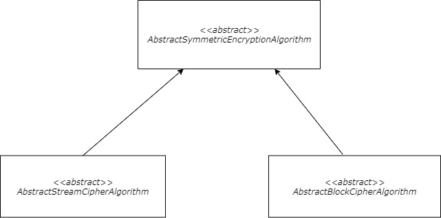



### [](#symmetric-cryptography){:.book_mark}Symmetric Cryptography ###

&nbsp;&nbsp;&nbsp;&nbsp;The type of symmetric cryptography, that is also known as secret key cryptography, defines a
security system that uses a single shared secret key (or configuration) to encrypt and decrypt information. The main
reason why they are called symmetric is the fact that each operation (encryption/decryption) uses the same single
configuration. The symmetric ciphers are widely used for encrypting huge amounts of data that need to be reused or
readable of certain parties (in contrast to the one-way hash functions). They are mainly used to encrypt/decrypt network
communications, storage devices, sensitive files or payment details. The encrypted data (ciphertext/cypherdata) is
secure if only the concerned parties have the secret key and the data processing is really fast. There are two main
types of ciphers at this category:

- Stream ciphers - Algorithms that process data symbol by symbol and transform it in some matter;
- Block ciphers - Modern ciphers that devide the processing logic into blocks of the original information.

&nbsp;&nbsp;&nbsp;&nbsp;The **CryptoMañana (CryptoManana) cryptography framework** provides object-oriented components
for each of the two types and has a huge set of available realizations.

### [](#basic-methods){:.book_mark}Basic Methods ###

&nbsp;&nbsp;&nbsp;&nbsp;The provided software components for symmetrical encryption in the cryptography model always
include:

```php
encryptData() // encrypt a string of binary data
decryptData() // decrypt a ciphertext representation
encryptFile() // encrypt a file's content
decryptFile() // decrypt a file's content
encryptObject() // encrypt an object's serialization state
decryptObject() // decrypt an object's serialization state
setSecretKey() // set the secret key
getSecretKey() // get the secret key
setCipherFormat() // set the ciphertext format
getCipherFormat() // get the ciphertext format
```

*Note: The simples way to generate a cryptographic configuration is via the framework, by using the [`TokenGenerator`](
../api/classes/CryptoManana.Utilities.TokenGenerator.html "TokenGenerator randomness protocol"){:target="_blank"}
component (which will be examined in more details in one of the next pages of this manual).*

### [](#ciphertext-format){:.book_mark}Ciphertext Format ###

&nbsp;&nbsp;&nbsp;&nbsp;The software framework supports a vast variety of well-know and frequently used data formats for
the input/output ciphertext value. Each symmetrical encryption object provides 5 formats that can be easily configured.
The specific format can be enabled via the `setCipherFormat()` setter method (the default setting
is `ENCRYPTION_OUTPUT_BASE_64_URL`) and the available format setting constants per each object. The following options
are available for each component:

- `ENCRYPTION_OUTPUT_BASE_64_URL` - The raw byte string representation, used by PHP for working with byte arrays (for
  example `�6�a`);
- `ENCRYPTION_OUTPUT_HEX_UPPER` -  **This is the default format** that uses the most popular uppercase HEX
  representation (for example `AB45`);
- `ENCRYPTION_OUTPUT_HEX_LOWER` - The lowercase HEX outputting format (for example `7f39`);
- `ENCRYPTION_OUTPUT_BASE_64` - The Base64 standard string representation (for example `B3xGTA==`);
- `ENCRYPTION_OUTPUT_BASE_64_URL` - The Base64 URL friendly string format (for example `B3xGTA`).

### [](#stream-ciphers){:.book_mark}Stream Ciphers ###

&nbsp;&nbsp;&nbsp;&nbsp;The first supported type is the stream cipher that is important for historical reasons, but is
not as secure as modern block algorithms. This category is mostly used for key transformations (similar to HKDF
functions) or for legacy system support. The supported algorithm/standard realizations at the
[`\CryptoManana\SymmetricEncryption`](../api/namespaces/CryptoManana.SymmetricEncryption.html "Encryption namespace"){:
target="_blank"} namespace are:

- `Rc4` - The RC4-128 encryption algorithm object.

&nbsp;&nbsp;&nbsp;&nbsp;This type of component has 1 public constant available:
```php
KEY_SIZE // The secret key size measured in bytes
```

&nbsp;&nbsp;&nbsp;&nbsp;Here is a simple example for the usage of this type of encryption component:



```php
use CryptoManana\SymmetricEncryption\Rc4;
use \stdClass as stdClass;

$crypter = new Rc4();

$crypter->setSecretKey('hit hard and run')
    ->setCipherFormat($crypter::ENCRYPTION_OUTPUT_BASE_64_URL); // or `Rc4::`

$data = 'testing information';
echo 'Data: ' . $data . PHP_EOL;

$cipherData = $crypter->encryptData($data);
echo 'Cipher Data: ' . $cipherData . PHP_EOL;

echo $data === $crypter->decryptData($cipherData) ?
    'Data is decrypted successfully' : 'Wrong decryption!';

$object = new stdClass();
$object->data = $data;

$cipherObject = $crypter->encryptObject($object);
echo 'Cipher Object: ' . $cipherObject . PHP_EOL;

$tmp = $crypter->decryptObject($cipherObject);

echo $object->data === $tmp->data ?
    'Object is decrypted successfully' : 'Wrong decryption!';

$encryptedContent = $crypter->encryptFile(__FILE__);

$fileName = trim(sys_get_temp_dir()) ?: (string)ini_get('upload_tmp_dir');
$fileName .= DIRECTORY_SEPARATOR . 'testing-file.encrypted';

file_put_contents($fileName, $encryptedContent);

$decryptedContent = $crypter->decryptFile($fileName);

echo file_get_contents(__FILE__) === $decryptedContent ?
    'File is decrypted successfully' : 'Wrong decryption!';

@unlink($fileName);
```

### [](#block-ciphers){:.book_mark}Block Ciphers ###

&nbsp;&nbsp;&nbsp;&nbsp;The second supported type is the modern type of standard for symmetrical encryption. This
symmetric system requires 3 additional parameters to ensure the division of fixed-size blocks and the data processing is
secure enough. The first one is the initialization vector (IV) that acts as a semantically second key and is used at the
selected mode of operation in some manner. The second parameter is the type the block mode that sets the logic for the
block processing and the connection between certain data values. The final parameter is the padding standard, which
defines the logic used to make the final block long enough to ensure it is the same size as each of the other ones.
Depending on the selected values for the three parameters, the encryption/decryption operation will follow a certain
processing logic that can or can not be run in parallel. For more information, please look up
the **[Block cipher mode of operation Wikipedia page](https://en.wikipedia.org/wiki/Block_cipher_mode_of_operation){:target="_blank"}**
(or other cryptography literature, etc.). The supported algorithm/standard realizations at the
[`\CryptoManana\SymmetricEncryption`](../api/namespaces/CryptoManana.SymmetricEncryption.html "Encryption namespace"){:
target="_blank"} namespace are:

- `Aes128` - The AES-128 symmetrical encryption object;
- `Aes192` - The AES-192 symmetrical encryption object;
- `Aes256` - The AES-256 symmetrical encryption object;
- `Camellia128` - The CAMELLIA-128 symmetrical encryption object;
- `Camellia192` - The CAMELLIA-192 symmetrical encryption object;
- `Camellia256` - The CAMELLIA-256 symmetrical encryption object;
- `TripleDes` - The 3DES-168 (T-DES) symmetrical encryption object.

&nbsp;&nbsp;&nbsp;&nbsp;It is important mention that the block cipher components have 6 other methods available:

```php
setInitializationVector() // set the initialization vector
getInitializationVector() // get the initialization vector
setBlockOperationMode() // set the block operation mode
getBlockOperationMode() // get the block operation mode
setPaddingStandard() // set the padding standard
getPaddingStandard() // get the padding standard
```

&nbsp;&nbsp;&nbsp;&nbsp;This type of component has 1 public constant available:
```php
KEY_SIZE // The secret key size measured in bytes
IV_SIZE // The initialization vector measured in bytes
BLOCK_SIZE // The internal block size measured in bytes
```

&nbsp;&nbsp;&nbsp;&nbsp;Each symmetrical block encryption object provides 5 modes of operation that can be easily
configured. The specific mode can be enabled via the `setBlockOperationMode()` setter method (the default setting
is `CBC_MODE`) and the available setting constants per each object. The framework support the following block operation
modes for encryption/decryption:

- `CBC_MODE` - The Cipher Block Chaining (CBC) mode of operation, **this is the default mode**;
- `CFB_MODE` - The Cipher Feedback (CFB) mode of operation;
- `OFB_MODE` - The Output Feedback (OFB) mode of operation;
- `CTR_MODE` - The Counter (CTR) mode of operation (not supported by `TripleDes`);
- `ECB_MODE` - The Electronic Codebook (ECB).

&nbsp;&nbsp;&nbsp;&nbsp;The symmetrical block encryption object provides 2 padding standards that can be easily
configured. The specific padding mode can be enabled via the `setPaddingStandard()` setter method (the default setting
is `PKCS7_PADDING`) and the available setting constants per each object. The framework support the following final block
padding modes for encryption/decryption:

- `ZERO_PADDING` - The zero-padding (non-standard);
- `PKCS7_PADDING` - The PKCS#7 (Cryptographic Message Syntax Standard) padding, **this is the default padding**.

&nbsp;&nbsp;&nbsp;&nbsp;Here is a simple example for the usage of this type of encryption component:



```php
use CryptoManana\SymmetricEncryption\Aes256;
use \stdClass as stdClass;

$crypter = new Aes256();

$crypter->setSecretKey('hit hard and run')
    ->setInitializationVector('run hard and hit')
    ->setCipherFormat($crypter::ENCRYPTION_OUTPUT_BASE_64_URL); // or `Aes256::`

$crypter->setBlockOperationMode($crypter::CFB_MODE) // or `Aes256::`
    ->setPaddingStandard($crypter::PKCS7_PADDING); // or `Aes256::`

$data = 'testing information';
echo 'Data: ' . $data . PHP_EOL;

$cipherData = $crypter->encryptData($data);
echo 'Cipher Data: ' . $cipherData . PHP_EOL;

echo $data === $crypter->decryptData($cipherData) ?
    'Data is decrypted successfully' : 'Wrong decryption!';

$object = new stdClass();
$object->data = $data;

$cipherObject = $crypter->encryptObject($object);
echo 'Cipher Object: ' . $cipherObject . PHP_EOL;

$tmp = $crypter->decryptObject($cipherObject);

echo $object->data === $tmp->data ?
    'Object is decrypted successfully' : 'Wrong decryption!';

$encryptedContent = $crypter->encryptFile(__FILE__);

$fileName = trim(sys_get_temp_dir()) ?: (string)ini_get('upload_tmp_dir');
$fileName .= DIRECTORY_SEPARATOR . 'testing-file.encrypted';

file_put_contents($fileName, $encryptedContent);

$decryptedContent = $crypter->decryptFile($fileName);

echo file_get_contents(__FILE__) === $decryptedContent ?
    'File is decrypted successfully' : 'Wrong decryption!';

@unlink($fileName);
````

### [](#the-object-hierarchy){:.book_mark}The Object Hierarchy ###

&nbsp;&nbsp;&nbsp;&nbsp;The internal components' hierarchy is visualized as a technical diagram and can be seen at
Figure 1.

{:
.centered_item}

*Figure 1: The data symmetric encryption components hierarchy.*{: .centered_item}

&nbsp;&nbsp;&nbsp;&nbsp;For more information about the capabilities of the components, please see the technical
documentation for
[`\CryptoManana\SymmetricEncryption`](../api/namespaces/CryptoManana.SymmetricEncryption.html "Encryption namespace"){:
target="_blank"} namespace are.


