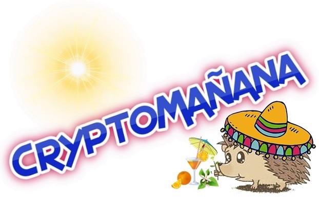

[](https://en.wikipedia.org/wiki/Open-source_software)
[](https://github.com/TonyKaravasilev/CryptoMananaDocs/blob/master/LICENSE)
[](https://doi.org/10.5281/zenodo.2604693)
[](https://github.com/TonyKaravasilev/CryptoManana)
[](https://www.paypal.com/cgi-bin/webscr?cmd=_donations&business=BFKJXWRLFTFQA&currency_code=USD&source=url) <br><br>
&nbsp;[](https://github.com/TonyKaravasilev/CryptoManana)



**See Source:** [Project Repository](https://github.com/TonyKaravasilev/CryptoManana){:target="_blank"}



## Project Description
CryptoMañana (CryptoManana) is a PHP cryptography framework that provides object-oriented solutions for boosting your project's security.
The code base of the project follows the S.O.L.I.D/KISS/DRY principles and implements a few popular Software Design Patterns.
The software framework provides a fully functional cryptography model with a vast of cryptography primitives and protocols.
It is very useful for secure hashing, encryption, key exchange, data signing, random data generation and even more.
CryptoMañana is here to make your development faster and more secure!

**Developer: [Tony Karavasilev](https://karavasilev.info)**

## Project Installation
```bash
# Install the package at your project via Composer
composer require karavasilev/cryptomanana

# Optionally, check if your system is well-configured
php vendor/karavasilev/cryptomanana/check.php
```

## Project Requirements
- `PHP Version`: 5.5, 5.6, 7.0, 7.1, 7.2, 7.3 or 7.4;
- The `spl` extension (bundles with PHP >= 5.0.0, added to core since PHP >= 5.3.0);
- The `hash` extension (bundled with PHP >= 5.1.2, added to core since PHP >= 7.4.0);
- The `openssl` extension (added by default for PHP >= 5.0.0, needs the OpenSSL Library);
- The `OpenSSL Library` installed by default with many Operating Systems and LAMP servers;
- The `Composer Dependency Manager` for PHP or manual autoloading via `src/autoload.php`;
- *Optional Extensions:* `libsodium` or`sodium`, `mbstring`, `zend-opcache` and `apcu`.

### Project Citation via DOI
- **The CryptoManana Framework** - [DOI 10.5281/zenodo.2604693](https://doi.org/10.5281/zenodo.2604693) *(concept)*

## The Technical Documentation
[The API Documentation](api/){:target="_blank"} (generated via phpDocumentor) <br>
[The Agile Documentation](testdox/){:target="_blank"} (generated via PHPUnit)

## The Framework Documentation
[The Framework Manual](docs/){:target="_blank"}
